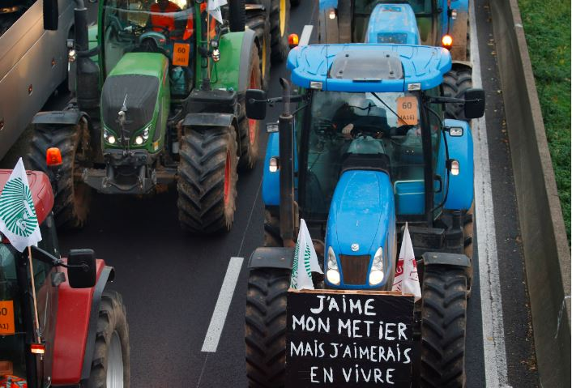
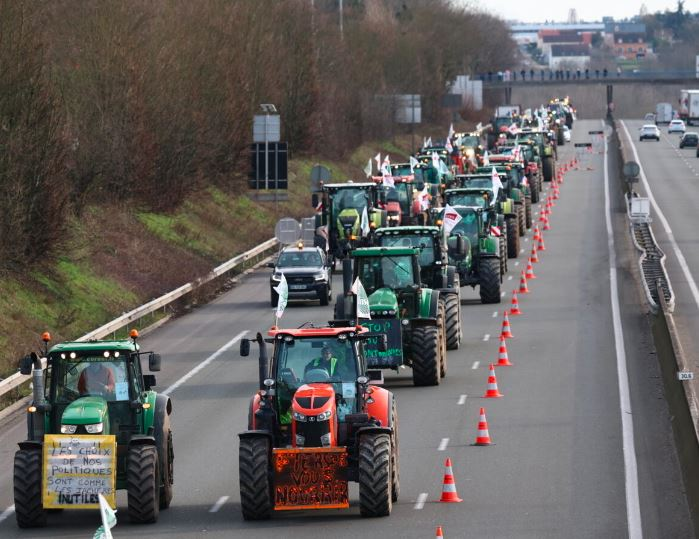
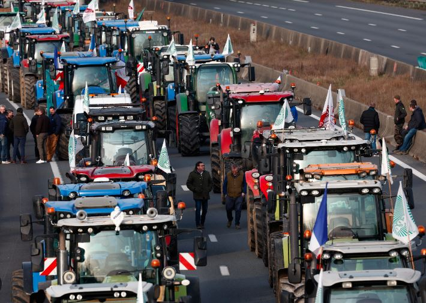

Kuri uyu wa kane ibihumbi by'abahinzi bo mu bufaransa bitabiriye imyiaragambyo basaba ko ibibazo byabo byitabwaho gusa Abashinzwe umutekano bawukajije ngo bahangane n'abarenga umurongo utukura bahawe.

Abahinzi barasaba leta y'ubufaransa guha agaciro umwuga wabo ndetse no kuzamura igiciro baguriraho imisaruro yabo  dore ko ngo bagurirwa ku giciro gito ku bicuruzwa imbere mu gihugu nyamara ngo abafaransa benshi batunzwe n’ubuhinzi bwabo.

Imyigarambyo imaze icyumweru iba, icyakora yafashe indi ntera kuva kuwa mbere w'iki cyumweru, kuri uyu wa kane naho ibihumbi by'abahinzi biriwe mu mihanda biyongereye ndetse bajyanye nibimashimi bihinga mu mihanda ijya I paris ndetse no ku bibuga byindege ngo barebe k ubutegetsi busha bwa minisitire w’inteeb Gabriel attal  hari icyo bwabikoraho.

Ibimashini bihinga byashyizweho ibyapa binini bivuga ngo turengere ubuhinzi.

Leta y’ubufaransa yabujije abigaragambya kugera mu mijyi minini ndetse no mu isoko rinini ricuririzwamo I paris.

Biteganijwe mu nama y'umuryango w'ubumwe bw'uburayi iteganijwe kuri uyu wa kane ari bwo baganira ku byifuzo byaba bahinzi, Dore ko uburayi ahanini butunzwe numusaruro uva mu bufaransa. Ubu kandi abahinzi bahagaritse kugurisha umusaruro wabo I paris ngo barebe ko leta y'ubufaransa yacyemura ikibazo cyabo mu maguru mashya.

 

**African Updates**
