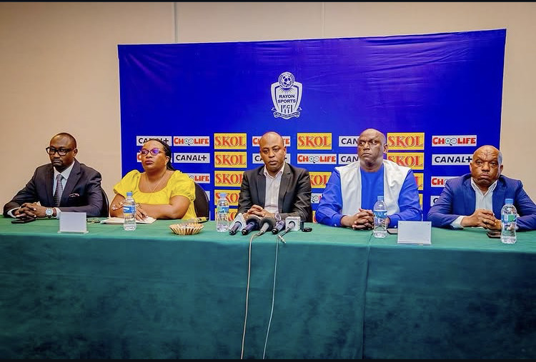

Kuri uyu wa Kane tariki ya 4 (ukwezi kutavuzwe), mu kiganiro n’itangazamakuru cyabereye kuri Hôtel des Mille Collines, Murenzi Abdallah, Perezida wa Association Rayon Sports uyoboye ubuyobozi bw’inzibacyuho, yatangaje ko Gakwaya Olivier ari we wagizwe Umuvugizi mushya w'ikipe, hanashyirwaho komisiyo enye zizamufasha mu kazi ko kuyobora mu mezi atatu y’inzibacyuho.

Gakwaya Olivier, wabaye Umunyamabanga wa Rayon Sports mu 2013 ndetse no muri 2017, ni we wahawe inshingano zo kuvugira ikipe. Ubusanzwe ni umwe mu bazi neza imiterere n’imicungire y’iyi kipe ikundwa n’abatari bake mu Rwanda.

Komisiyo zashyizweho harimo Komisiyo y’Imiyoborere igizwe na  Dr Rwagacondo Emile, Dr Uwiragiye Norbert, Ignace Havugiyaremye. Kabagema Vivens, Muhizi Sued, Runigikanischen Mike na Ahishakiye Phias

Hari na Komisiyo y'Umutungo igizwe na Ndikumana Jean Felix,  Rukundo Patrick, Byiringiro Bernard,  Habyarimana Straton,  Ndikumukiza Revelien, Kabiligi Yussuf na Nshyimyabarezi Abraham

Muri Komisiyo ya Tekiniki harimo Muhirwa Prosper, Gacinya Chance Denis, Kamali Gustave, Murangwa Eugene, Amri Jean Paul na Dr Uwimana François Xavier

Hashyizweho kandi Komisiyo y’Amategeko irimo Me Ntagengwa Vital, Minani Faustin, Me Ndikumana Vincent, Me Mana Jean Paul, Me Yvette Ingabire

Mu mazina yatangajwe hagaragaramo bamwe mu basanzwe bazwi muri Rayon Sports ndetse banigeze kuba mu buyobozi bwavuyeho bushyizweho na RGB, ibintu byakiriwe neza n'abakunzi b'iyi kipe nk'ikimenyetso cy’ubufatanye n’imikoranire myiza mu guharanira iterambere n’ibisubizo by’ibihe bishya.

Ngabo Roben wari usanzwe ari Umuvugizi w’ikipe yasimbuwe na Gakwaya Olivier, ariko we akomeza imirimo yo kuyobora imbuga nkoranyambaga za Rayon Sports.

 

**Mutoni Divine / African Updates**
