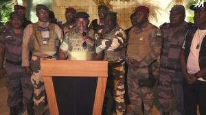

Nyuma y’amasaha macye byemejwe ko yatsinze amatora y’umukuru w’igihugu ali bongo yahiritswe ku butegetsi.

Ibyo ni ibyatangajwe mu rukerera rwo kuri uyu wa gatatu aho Igisirikare cya Gabon cyatangaje ko cyahiritse ku butegetsi Ali Bongo wari umaze amasaha make bitangajwe ko yegukanye amatora y’Umukuru w’Igihugu ku majwi 64.27%.

Mu gitondo cyo kuri uyu wa Gatatu kandi nibwo  Komisiyo y’Amatora muri Gabon yatangaje ko Ali Bongo yatsindiye manda ya gatatu. Nyuma y’amasaha make ibi bitangajwe kuri Televiziyo y’Igihugu hahise hajyaho itsinda ry’abasirikare bavuga ko bahiritse ubutegetsi bw’uyu mugabo.

\[caption id="attachment\_922" align="alignnone" width="300"\] Abasirikare bavuga ko bafashe ubutegetsi muri Gabon\[/caption\]

Aba basirikare bavuze ko batesheje agaciro ibyavuye mu matora kuko yakozwe mu buryo butanyuze mu mucyo.

Uretse guhirika ubutegetsi bwa Perezida Bongo, aba basirikare batangaje ko bafunze imipaka yose ndetse basesa n’inzego z’ubutegetsi zari ziriho.

Bavuze ko ibyo bari gukora byose biri mu izina ry’Igirikare cya Gabon n’izindi nzego z’umutekano.

Kugeza ubu ntiharatangazwa umusirikare uyoboye iki gikorwa cyo guhirika ubutegetsi bwa Bongo, n’uko igihugu kiri bukomeze kuyoborwa.

\[caption id="attachment\_922" align="alignnone" width="300"\] Abasirikare bavuga ko bafashe ubutegetsi muri Gabon\[/caption\]
