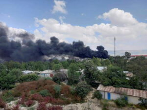

Muri Ethiopia haravuga igitero cy’indege cyatwaye ubuzima bw’abantu 26 Mu ijoro ryo ku cyumweru.

Ni igitero bivugwa ko cyabereye mu ntara ya Amhara imaze imyaka 2 mu mirwano nigisirikare kiri ku butegetsi aho gihanganye numtwe witwara gisirikare wo muri ako gace.

Bbc ivuga ko abaharanira uburenganzira bwa muntu muri Ethiopia bamaganye icyo gitero ndetse umwe mu bakora ku ivuriro avuga ko yumvise ikintu giturika mu masaha yumugoroba nyuma yumwanya batangira kwakira abakomeretse kwa ku muganga bari bambaye gisivile. ni mugihe kandi abagize inteko ishinga amategetko baraye bemeje ko hashyirwaho ibihe bidasanzwe muri Amhara bizamara amezi 6 ndetse hatowe itegeko ryemerera abashinzwe umutekano guta muri yombi no gufunga batagombye kubihererwa uburenganzira nurukiko.

Umutwe wa fono urwanira muri ako gace uvuga ko leta ishaka guca integer ubwirinzi bwabo ibyo bavuga ko bazakomeza guhagararaho .

Uyu mutwe ariko mu bihe byabanje wavugaga rumwe n’ingabo za keta dore ko banafatanije mu rugamba rwo guhangana na tplf yo muri Tigray icyakora iyo mirwano yarangiye mu gushyingo kwa 2022 ingabo za leta zasabye uwo mutwe gushyira intwao hasi uranga imirwano itangira ityo kugeza nuyu munsi.

