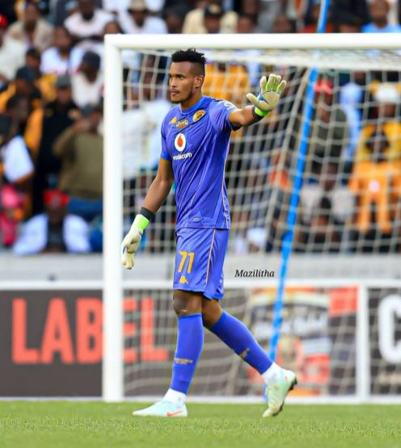
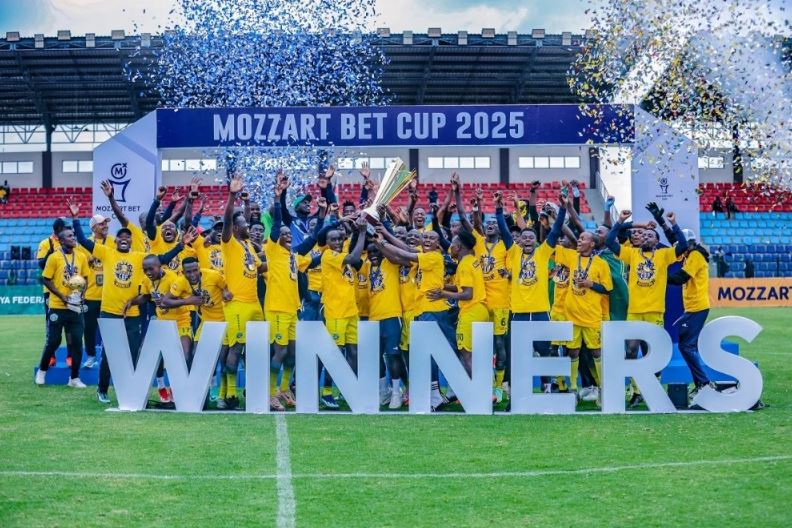

Imikino y’amajonjora ya mbere y’amarushanwa ya CAF Champions League na CAF Confederation Cup 2025/2026 irangiye, aho bamwe mu bakinnyi b’Abanyarwanda bakina hanze y’igihugu batangiye kwandika amateka mashya ku rwego rwa Afurika.

Abakinnyi batatu b’Abanyarwanda barimo Mugisha Bonheur, Ntwari Fiacre na Buregeya Prince, bamaze gufasha amakipe yabo kugera mu matsinda ya CAF Confederation Cup, irushanwa rikomeje gutanga icyizere mu iterambere ry’umupira w’amaguru muri Afurika.

Mugisha Bonheur, ukinira Al Masry yo mu Misiri, yabonye itike yo gukina amatsinda nyuma yo gusezerera Al-Ittihad yo muri Libya ku giteranyo cy’ibitego 2-1. Ntwari Fiacre, umunyezamu wa Kaizer Chiefs yo muri Afurika y’Epfo, yafashije ikipe ye gusezerera AS Simba yo muri RDC ku bitego 3-1 mu mikino yombi.

 Na ho Buregeya Prince, ukinira Nairobi United yo muri Kenya, yatsinze Esperance du Sahel yo muri Tunisia kuri penaliti 6-5 nyuma yo kunganya 2-2, mu mikino yombi.

Iyi kipe ya Nairobi United ni imwe mu zatunguranye muri uyu mwaka kuko yazamutse mu Cyiciro cya Mbere vuba, ikaba yaranatwaye Igikombe cy’Igihugu itsinze Gor Mahia ku mukino wa nyuma.

Ku ruhande rwa CAF Champions League, Abanyarwanda Bizimana Djihad na Manzi Thierry bakinira Al Ahly Tripoli yo muri Libya, bagihatanira itike yo kugera mu matsinda nyuma yo kunganya na RS Berkane yo muri Maroc igitego 1-1, mu mukino ubanza. Uwo kwishyura uteganyijwe tariki ya 1 Ugushyingo 2025.

Muri rusange, amakipe yo muri Afurika akomeje kuzamura urwego rw’imikinire ndetse n’ishoramari mu mupira w’amaguru. Ibihugu nka Misiri, Maroc, Tanzaniya, Afurika y’Epfo, Algeria na Nigeria bikomeje kuyobora muri uyu mukino, mu gihe ibindi bihugu birimo u Rwanda na Kenya bikomeje kwinjiza abakinnyi benshi mu makipe akomeye ya Afurika.

Amakipe yamaze kubona itike yo gukina CAF Champions League ni Mamelodi Sundowns, Simba SC, St Éloi Lupopo, MC Alger, Stade Malien, AS FAR, Power Dynamos, Al Ahly, Young Africans, Rivers United, Al Hilal Omdurman, JS Kabylie, Esperance de Tunis na Petro de Luanda.

Ni mu gihe CAF Confederation Cup izitabirwa na Zamalek, USM Alger, Wydad Casablanca, CR Belouizdad, Kaizer Chiefs, Stellenbosch, Azam FC, Singida Black Stars, ZESCO United, Maniema Union, San Pedro, OC Safi, Nairobi United, AS Otoho, Djoliba AC na Al Masry.

 

**Divine Mutoni / African Updates**
