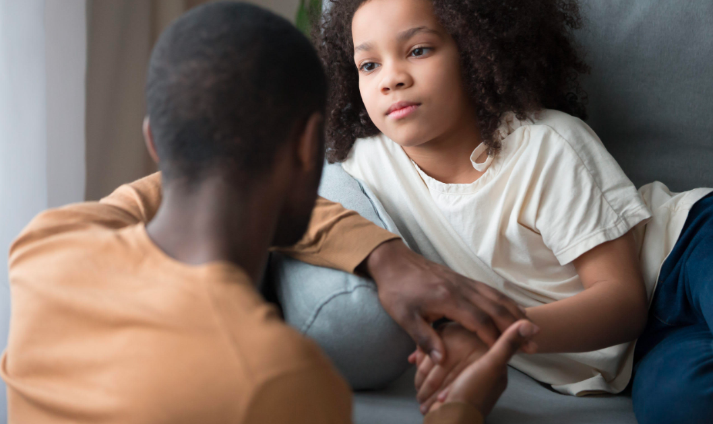
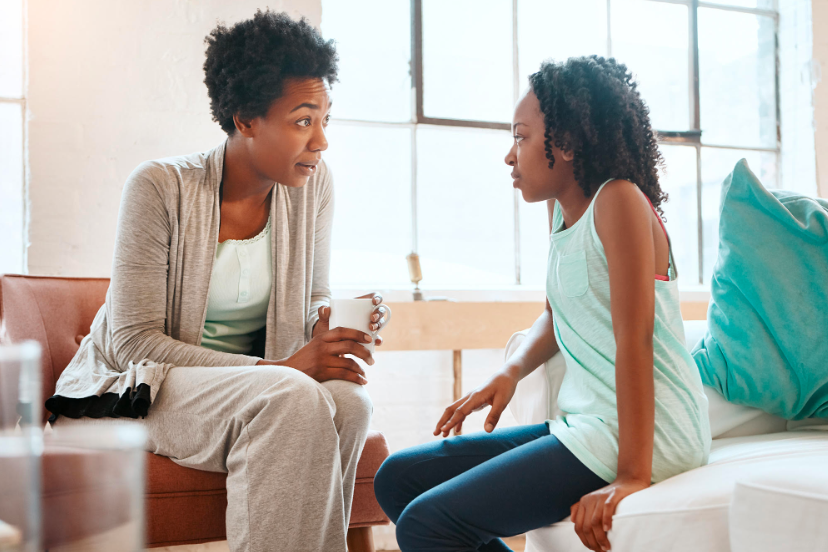

Ababyeyi benshi bihunza kwigisha abana babo ku buzima bw'imyororokere, bakabirekera abarezi, mu gihe abarezi na bo hari ibyo birengagiza bagirango ababyeyi barabyigishije, bigatuma abana bakura hari amakuru badafite kandi y'ingenzi.

Ni akahe kamaro ko kuganiriza abana ku bijyanye n'igitsina?

Uko abana barushaho kumenya ibijyanye n'ubuzima bw'imyororokere yabo, ni ko barushaho gutekana no kwisobanukirwa

Dore zimwe mu mpamvu abana bakwiye kuganirizwa ku bijyanye n'igitsina ndetse n'ubuzima bw'imyororokere:

1\. Inda mu bangavu no gukuramo inda: imyizerere n'imigenzo ya kera bifite akamaro kanini cyane mu kuzamura gutwita mu bangavu no gukuramo inda. Ku bangavu benshi batwitiye iwabo, hari amahirwe menshi yo gukuramo inda kubera igitutu bashyirwaho n'ababyeyi n'ipfunwe mu muryango.

2\. Kwikinisha no kwiroteraho: hari imyumvire n'imyemerere itariyo ku birebana no kwikinisha no kwiroteraho (gusohora ku bahungu basiziriye), ntukabeshye abana, babwire ukuri ari wenda atari ukuri kose, nukanga abana barangiza bakumva ibindi bintu, bazahita bagutera ikizere. Ujye uvugisha ukuri kose gushoboka muri ako kanya.

3\. Iby'abaryamana bahuje igitsina: mu ntangiro z'ubwangavu, ubushuti n'abo duhuje igitsina no kutibonamo abo tudahuje igitsina birasanzwe. Akenshi bituruka mu kugerageza ibindi bintu cga kwipima hanyuma mu bwangavu bigahinduka, hakaza umuco wo kwiyumvamo abo tudahuje igitsina. Iyo umwana arenze mu bwangavu akiri kwiyumvamo abo bahuje igitsina kurusha abo badahuje, bishobora kuvamo ikibazo gikeneye kwitabwaho.

4\. Igihunga no kutigirira ikizere: kwishidikanyaho ku bijyanye n'ingano y'igitsina, kwiroteraho, kumera insya n'ibindi bice biranga igitsina cy'umuntu, n'ubushobozi bwo gukurura cga kwisangamo abo badahuje igitsina bikomeza kuba inkomoko y'igihunga n'ubwoba mu bangavu, rimwe na rimwe bisaba guhumurizwa no kuganirizwa. Niba umwana nta makuru ahagije afite bishobora kumubera inkomoko yo kutigirira ikizere iyo agererabyije ibice bye n'ibyurungano birirwana.

5\. Ihohoterwa rishingiye ku gitsina: ihohoterwa ku gitsina byemezwa iyo habayeho imibonano mpuzabitsina nta ruhushya rwatanzwe. Imyaka yo gutanga uruhushya ni 16 y'ubukure, imibonano mpuzabitsina ikozwe n'umuntu uri munsi y'iyo myaka n'ubwo haba hatanzwe uruhushya ni icyaha gihanwa n'amategeko, ni ihohotera. Iyo umwana ahohotewe, bimwangiza mu mutwe, ndetse bishobora kumuviramo kugira ibibazo n'imibanire n'abandi, kuba ikirara cga akaba yajya mu biyobyabwenge.

Kongera ubumenyi mu bana n'imiryango yabo ni intambwe ikomeye mu kurinda ihohoterwa. Kwigisha abana kwirwanaho, kwirinda cga guhangana n'ihohoterwa na byo ni ingirakamaro.

Ubutaha tuzavuga ku ngingo uvugaho iyo uganiriza umwana ku buzima bw'imyororokere.

**Denyse MBABAZI MPAMBARA**

**African Updates**
