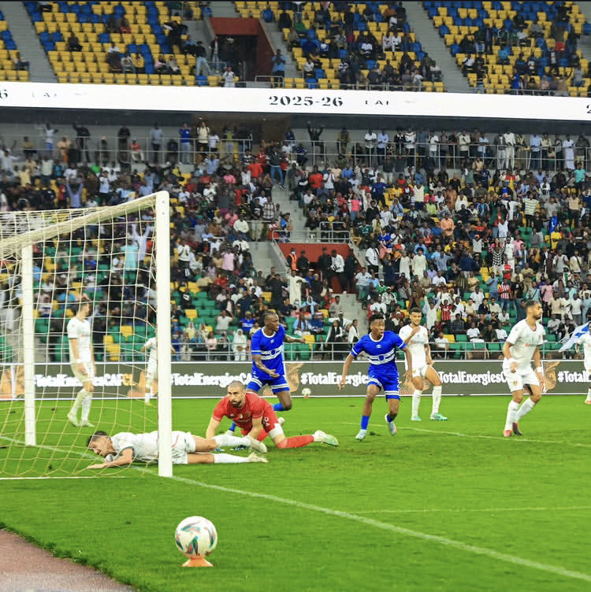

Al Hilal SC kuri ubu ibarizwa ku butaka bw’u Rwanda, aho izajya ikinira imikino yayo ya shampiyona nk’ikipe y’abashyitsi nyuma yo guhabwa uburenganzira na CAF. Kuri uyu wa gatanu tariki ya 21/11/2025 yakiriye mu Rwanda ikipe ya MC Alger mu mukino wabereye kuri Stade Amahoro, I Remera mu mujyi wa kigali.

Uyu mukino warangiye Al Hilal itsinze ibitego nibiri (2 ) kuri kimwe (1). Igitego cya mbere cya Al Hilal cyabonetse ku munota wa 2 w’inyongera w’igice cya mbere, gitsinzwe na Omer Yagoub. Ariko ku munota wa 53, M. Karshom wa MC Alger yahise atsinda igitego cyo kunganya.

Al Hilal yakomeje kwitwara neza itsinda igitego cya kabiri cyaje kuyihesha intsinzi ku munota wa 75, gitsinzwe na Abdel Rahman.

Nubwo umukino wari uri gukurikirwa n’abafana benshi, wakomeje kugaragaramo ubushyamirane n’imyitwarire mibi hagati y’amakipe yombi, byanageze aho Alhassan wa Al Hilal ahabwa ikarita itukura ku munota wa 87.

MC Alger nayo yari yerekanye imideli idasanzwe mu mujyi wa Kigali, aho abafana bayo bagaragaye mu mihanda bafite imyotsi y’amabara y’ikipe, ndetse banagaragaza kutishimira imisifurire mu gihe umukino wari uri kuba.

Nyuma y’umukino, habayeho guterana amagambo n’imvururu hagati y’abakinnyi b’amakipe yombi. Byaturutse ku mukinnyi w’Umurundi Habumugisha Jean Luc ukinira Al Hilal, bivugwa ko yashotoraga abakinnyi ba MC Alger, bigatuma bashaka kurwana. Gusa Polisi y’u Rwanda yahise ihosha ayo makimbirane.

**Mutoni Divine / African Updates**
