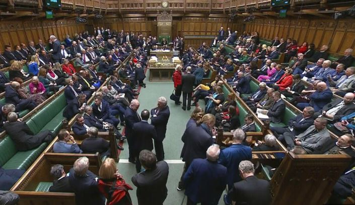

Inteko ishinga amategeko y’u bwongereza yaraye itoye umwanzuro wo gushyigikira gahunda y’igihugu cyabo yo kohereza abimukira mu rwanda.

Ni itora ryemeje ko u rwanda ari igihugu gitekanye. abatoye bashyigikiye iki cyemezo ni 313 mu gihe abatoye batagishyigikiye ari 269.

Iyi gahunda leta y’ubwongereza ivuga ko igamije guca intege abimukira bambuka bajya muri icyo gihugu mu buryo butujuje ibisabwa.

minisitire w’intebe w’ ubwongereza sunak yavuze ko biri mu byibanze yitayeho ku buyobozi bwe.

Uyu mushinga w’itegeko nyuma yo kwemerwa muri iki gice cy’inteko y’ubwongereza kizwi nka house of commons uzigirwa no mu wundi mutwe wo hejuru y'uwo uzwi nka house of lords.

**African Updates**
