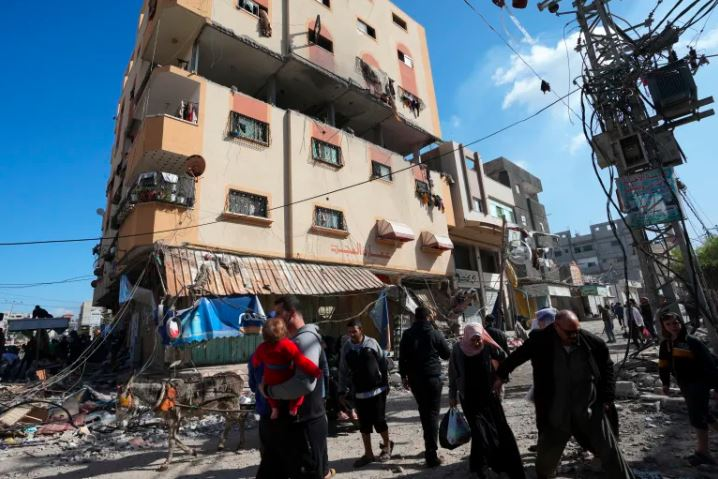

Ibiganiro hagati ya Hamas iyobora Gaza na Israel  byemeje ko habaho agahenge k’intambara ndetse abantu 50 bafashwe bakarekurwa. Ku rundi ruhande abagera ku 150 barimo abagore n’abana b’abanye Palestine bafashwe na Israel nabo ngo bazarekurwa nkuko byatangajwe.

kuri uyu wa kane leta ya Israel yavuze ko nta munye Palestine uzarekurwa mbere yo kuwa gatanu, ibyo byafashwe nk'amayeri yo gutinda gushyira mu bikorwa imyanzuro yemeranijweho mu biganiro byahuje impande zombi.

Muri ibyo biganiro umuhuza ni ubwami bwa Qatar, Bemeje ko hatangwa iminsi ine nta mirwano yumvikana  umuvgizi wa minisiteri y’ububanyi n’amahanga wa Qatar yavuze ko iyo ari intambwe nziza itewe ndetse hari icyizere ko imirwano yazahagarara by'igihe kirekire.

\[caption id="attachment\_1064" align="alignnone" width="718"\] Abanye-palestine bari imbere y'inyubako yateweho igisasu na Israel rwa gati muri Gaza.\[/caption\]

Naho umushumba wa kiliziya ku isi pope Francis yavuze ko ibiri kuba birenze intambara ahubwo ari iterabwiba. Ni nyuma yo guhura n’imiryango yavuze ababo muri Israel na Palestin asaba amasengesho ku mpande zombi ngo zumvikane amaraso arekere ku meneka.

Hagati aho abantu 14,100 bamaze gupfa muri Gaza nkuko bitangazwa na minisiteri y'ubuzima muri Gaza.

**African Updates**
