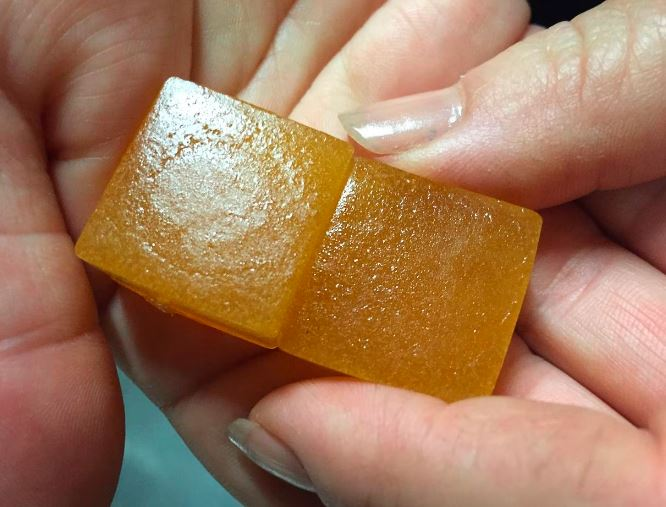
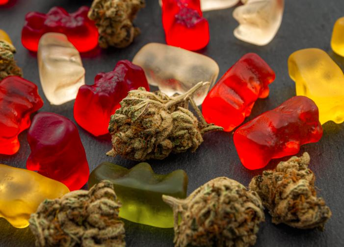

Abanyeshuli barenga 60 bari mu bitaro nyuma yo kurya za bombo zirimo urumogi.

Ni yemejwe na minisiteri y’uburezi muri Jamaica bavuga ko abana bariye izo bombo zari zinjijwe mu kigo ndetse hari handitseho ko zitemewe ku bana.

Nyuma yo kuzirya abana barasinze ndetse bamwe babona ibidahari bakamera nkabarota byageze naho bamwe batangira kugarura ibyo bariye.

Ubu rero bari kwa muganga ndetse bari kwitabwaho nubwo inzego zubuzima zivuga ko bariye ibiyobyabwenge byinshi.

Abana bariye urumogi bari mu kigero cy’imyaka iri Hagati y’irindwi na cumi n’ibiri.  Ababyeyi babo bavuga ko batumva uburyo ibiyobyabwenge nkibyo bigera mu bigo byishuli.

Hagati aho ikigo gishinzwe kugenzura imiti n’ibiribwa muri Jamaica bavuga ko ibyo bicuruzwa bitemewe muri icyo gihugu nubwo ikiyobyabwenge cy’urumogi ruke rwemewe ku muntu uwo ariwe wese ubyifuza.

