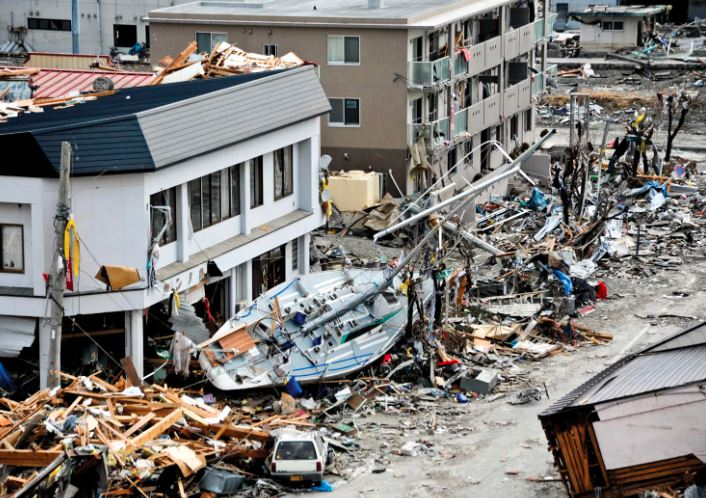
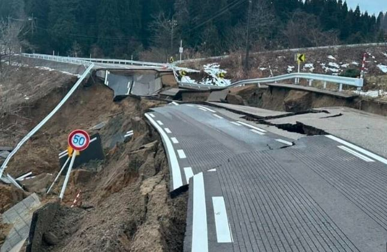

Mu buyapani abantu 60 nibo bamaze kubarurwa ko baguye mu mutingito wabaye kuwa mbere  wiki cyumweru.

Uwo mutingito wari ku igipimo cya 7.6 ni igipimo kiri hejuru.

Minisitire w’intebe Fumio kishida yavuze ko hari abandi bakomeretse ndetse ngo bari gusiganwa nigihe ngo batabare abagwiriwe n’ibikuta byinzu .

Abantu 1000 bashinzwe ubutabazi bari gukora ibishoboka byose ngo batabare naho igisirikare kiri gufasha mu gutanga ibyo kurya

Perezida wa Amerika Joe Biden yihanganishije ubuyapani avuga ko igihugu cye kiteguye gutanga ubufasha igihe cyose gikenewe.

Uyu mutingito kandi bavuga ko ushobora gutera Icyiza cya Tsunami ndetse ubuyobozi bwasabye ko abaturiye inyanja bujya kure yayo.

**African Updates**
