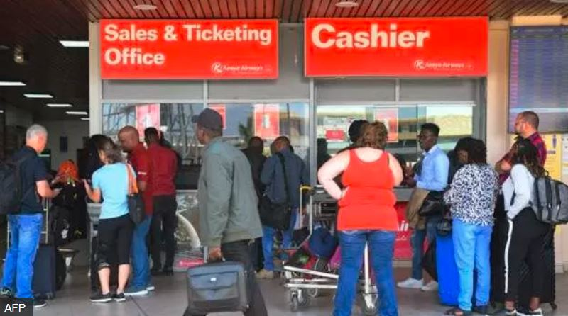

Muri kenya abaturage bari kwamagana icyemezo cya leta cyo gusoresha abinjiye mu gihugu .

Ni imisoro mishya yashyizweho aho uwinjiye muri kenya yaba umunyamahanga cyangwa umunyagihugu aba agomba gutanga umusoro wicyo yinjiranye ariko gifite agaciro kari hejuru ya y’amadorari 500

Ibyo kandi ntibireba ku gikoresho gishya cyangwa igisanzwe gikora. Icyakora ibyo byakiriwe nabi n'abaturage bavuga ko bidakwiye ndetse abagize inteko ishinga amategeko bamwe bavuga ko biri gusigira isura mbi igihugu ndetse ngo byagabanya umubare w’abasura icyo gihugu.

Ibyo kandi byashimangiwe na minisitire w’ubukerarugendo muri kenya avuga ko biri kugabanya abasura icyo gihugu.

Hakomeje gushyirwaho indi misoro muri kenya mu gihe nyamara Perezida William Ruto yiyamamaza yavugaga ko azayigabanya ndetse akoroshya n'igiciro cy'ubuzima aho muri kena.

