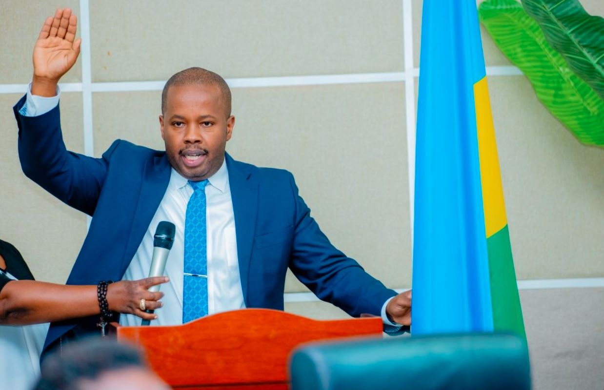
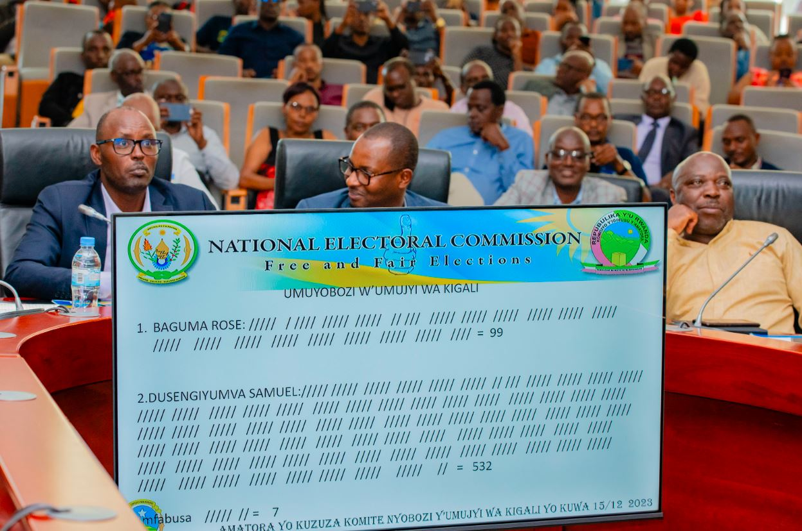
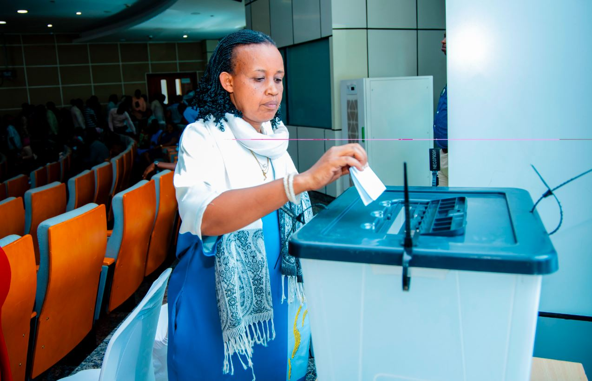
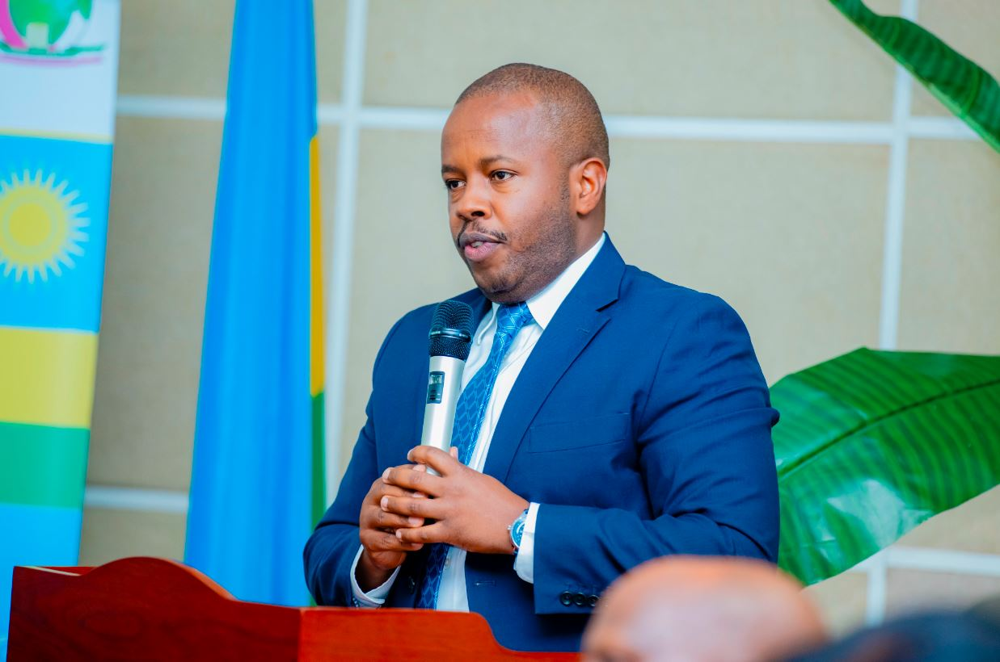

Kuri uyu wa gatanu Dusengiyumva Samuel yatorewe kuba Umuyobozi w'Umujyi wa Kigali.

Amatora y’umuyobozi w’umujyi wa Kigali yari yabaye kuri uyu wa gatanu tariki 15 Ukuboza mu 2023 ahanganyemo abakandida babiri aribo Dusengiyumva wari Umunyamabanga Uhoraho muri Minisiteri y’Ubutegetsi bw’Igihugu na Rose Baguma usanzwe ari Umuyobozi Mukuru ushinzwe Politiki y’Uburezi n’Isesengura muri Minisiteri y’Uburezi.

Samuel Dusengiyumva yagizwe Umuyobozi w’Umujyi wa Kigali, asimbura Pudence Rubingisa wahawe kuyobora Intara y’Uburasirazuba aho yagize amajwi 532 kuri 638.

Uyu mugabo yatowe ku majwi 532 mu gihe Rose Baguma yagize amajwi 99. Ay’imfabusa yabaye 7. Asimbuye Pudence Rubingisa wabaye Meya w’Umujyi wa Kigali muri Kanama 2019. Yatowe ari Meya wa cumi uyoboye umujyi wa Kigali nyuma ya Jenoside yakorewe Abatutsi.

Kuri uyu wa gatanu kandi Dusengiyumva yarahiriye kuba umwe mu Bajyanama 11 b’Umujyi wa Kigali kuri uyu wa 15 Ukuboza 2023, nyuma y’uko bitangajwe mu myanzuro y’Inama y’Abaminisitiri yateranye tariki 14 Ukuboza 2023.

**African Updates**
