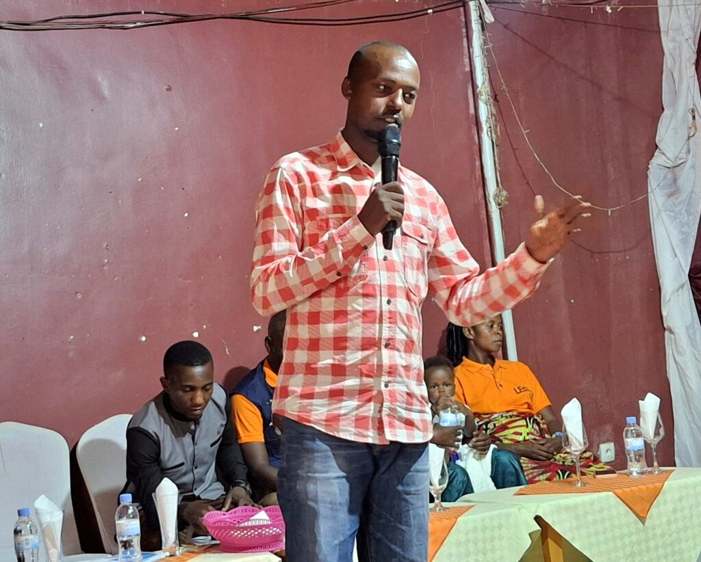
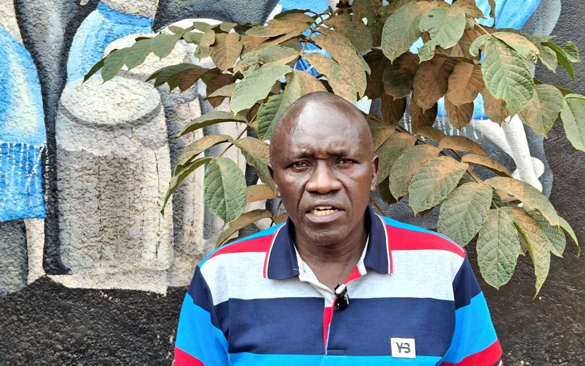
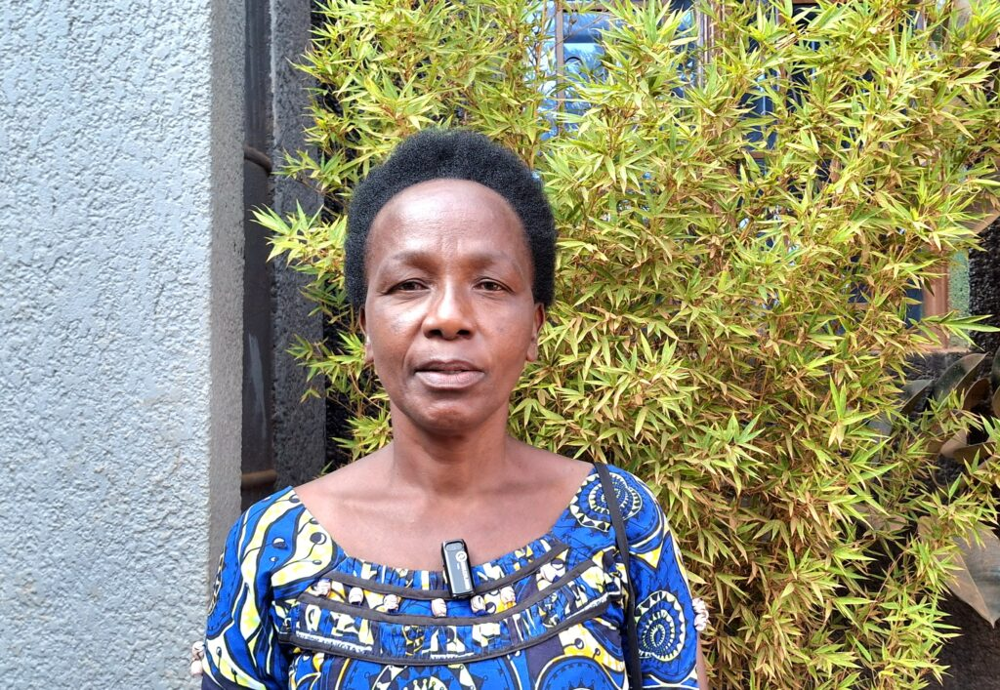
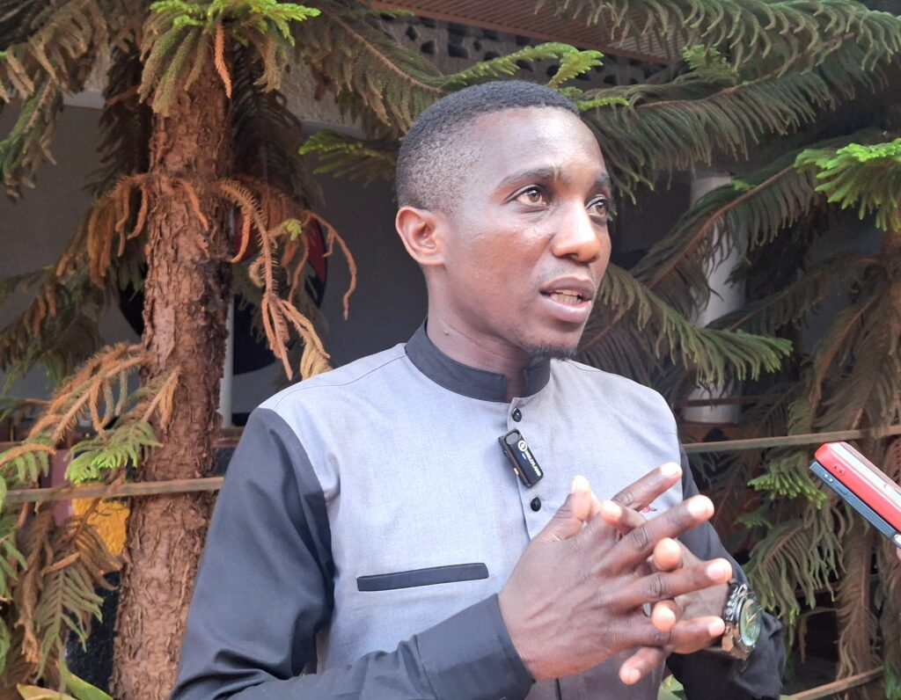
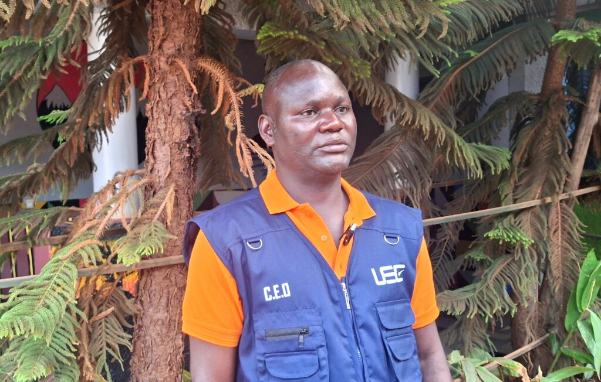
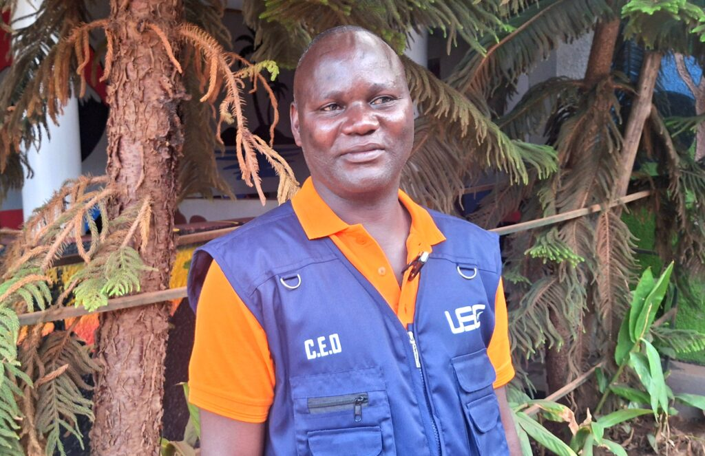
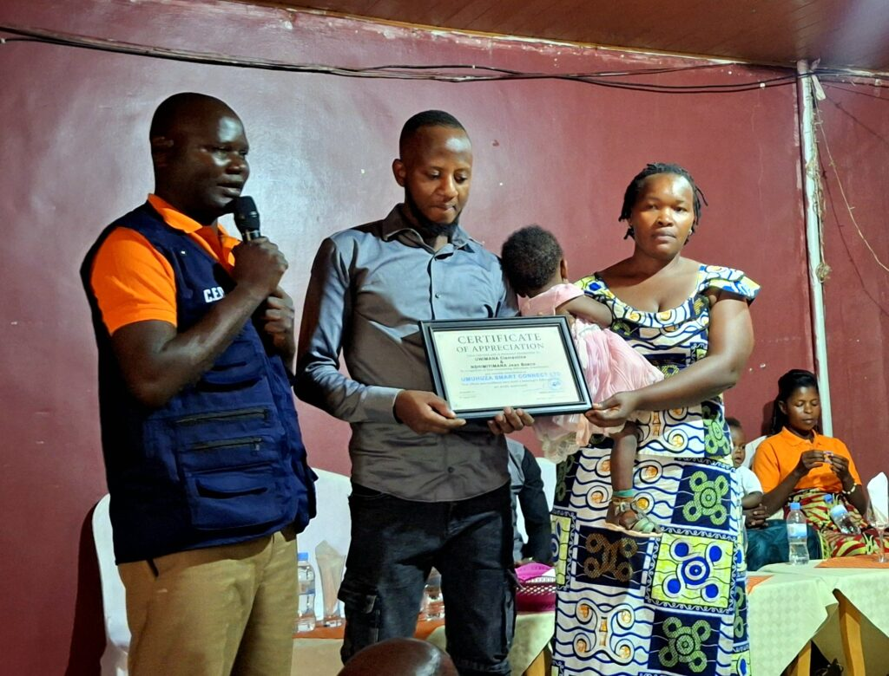
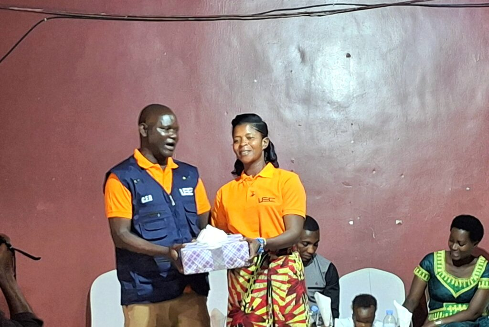
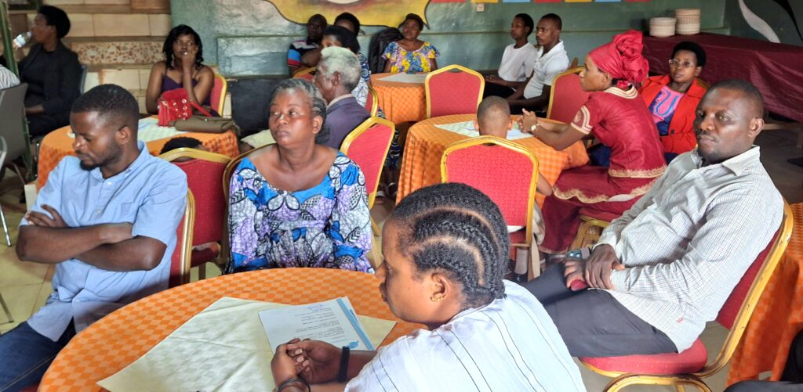
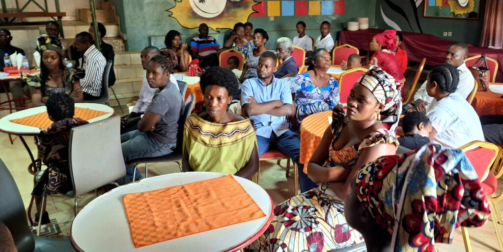

Kuri uyu wa Gatatu, mu Murenge wa Nduba, Akarere ka Gasabo mu Mujyi wa Kigali, habereye ubusabane bwahuje abanyamuryango b'itsinda Umuhuza Smart Connect baturutse mu bice bitandukanye bya Kigali. Ni igikorwa cyitabiriwe n’ ubuyobozi bw’ Umurenge wa Nduba, ubuyobozi bw’ Akagari ka Gasanze, ndetse n’ abanyamuryango b’itsinda bo hirya no hino.

Muri uyu muhango, hagarutswe ku byagezweho mu mwaka wa 2025 ndetse hatangazwa n’aho bifuza kugera mu mwaka utaha wa 2026.

Umuyobozi ushinzwe imibereho myiza mu Kagari ka Gasanze, yatangaje ko biteguye gukomeza gushyigikira ibikorwa by’iri tsinda. Ati: “Twiteguye kubaba hafi no kubashyigikira mu mishinga yanyu. Ubukungu buhera mu mutwe, niyo mpamvu tugomba gufatanya kugira ngo dukomeze kwiteza imbere.”

Yakomeje agaragaza ko yishimiye intambwe itsinda rimaze gutera mu iterambere ry’abanyamuryango baryo.

\[caption id="attachment\_1403" align="alignnone" width="1024"\] Umuyobozi ushinzwe imibereho myiza mu Kagari ka Gasanze, Umurenge wa Nduba\[/caption\]

Muhawenima Ildephonse, utuye mu Mudugudu wa Gashinya, Akagari ka Gasura, yavuze ko yamenye itsinda Umuhuza Smart Connect binyuze mu biganiro bya radiyo, nyuma aza kuyinjiramo nawe.

“Nayinjiyemo nyuma yo kumva ubusobanuro bw’umuyobozi kuri radiyo. Ubu maze imyaka ibiri ndi umunyamuryango. Ubwa mbere nagujije ibihumbi 300 Frw, nyuma nza kongera mpabwa ayikubye kabiri. Byamfashije gutera imbere no gufasha umuryango wanjye.”

\[caption id="attachment\_1406" align="alignnone" width="1024"\] Muhawenima Ildephonse, utuye mu Mudugudu wa Gashinya, Akagari ka Gasura, Umurenge wa Nduba.\[/caption\]

Mukanyangezi Angélique, utuye mu Mudugudu w’Uruhetse, Akagari ka Gasanze, yemeza ko imyaka amaze mu itsinda yamugiriye akamaro gakomeye. Yagize ati:

“Nashoboye gusana inzu yansenyukiyeho, none ubu ifite agaciro ka miliyoni 15 Frw. Ibi byose nabigezeho mbikesha ubufatanye n’iri tsinda binyuze mu mishinga y’ubuhinzi ku bifatanye n'iri tsinda."

\[caption id="attachment\_1405" align="alignnone" width="1024"\] Mukanyangezi Angélique, utuye mu Mudugudu w’Uruhetse, Akagari ka Gasanze.\[/caption\]

Ubuyobozi bw’Umurenge wa Nduba bwizeje gukomeza gufatanya n’abagize itsinda Umuhuza Smart Connect mu guteza imbere imibereho y’abaturage, by’umwihariko abafite imishinga iciriritse.

Uwizeyimana Laurent, umuyobozi mukuru w'itsinda Umuhuza Smart Connect mu Murenge wa Nduba, yashimangiye ko nubwo hari byinshi byagezweho, hakiri imbogamizi, zirimo Abakarani bakinjirwamo n’abantu batari abanyamuryango, bikagira ingaruka ku mutekano.

Abatwara abantu ku magare bahura n’imbogamizi z’abababuza kugera mu bice bimwe, ndetse hakaba n’igihe bacibwa amafaranga binyuranyije n’amategeko.

Yasabye inzego bireba gukurikirana ibi bibazo kugira ngo bibonerwe ibisubizo birambye.

\[caption id="attachment\_1401" align="alignnone" width="1024"\] Uwizeyimana Laurent, umuyobozi mukuru w'itsinda Umuhuza Smart Connect ryo mu Murenge wa Nduba\[/caption\]

Itsinda Umuhuza Smart Connect rihuriza hamwe abatwara abantu n'ibintu ku magare, abakarani n’abandi bakora imirimo iciriritse. Abanyamuryango babitsa amafaranga, hanyuma bakayagabana mu byiciro bibiri:

Abagabana buri mezi abiri, basangira hagati ya miliyoni 5 na miliyoni 6 Frw, naho Abagabana buri mezi atandatu, basangira miliyoni 15 Frw.

Uretse ibi, mu mwaka wa 2025 bishyuriye mituweli abantu 33, kandi bafite intego yo kuzabikuba kabiri mu mwaka wa 2026.

Iri tsinda ryagize uruhare rukomeye mu kuzamura imibereho y’abanyamuryango baryo no kugabanya ibikorwa by’urugomo bikorwa n’abatagira akazi. Abitabiriye ubusabane basabwe gukomeza guhuza imbaraga no gutekereza ku mishinga itanga inyungu irambye.

**African Updates**
