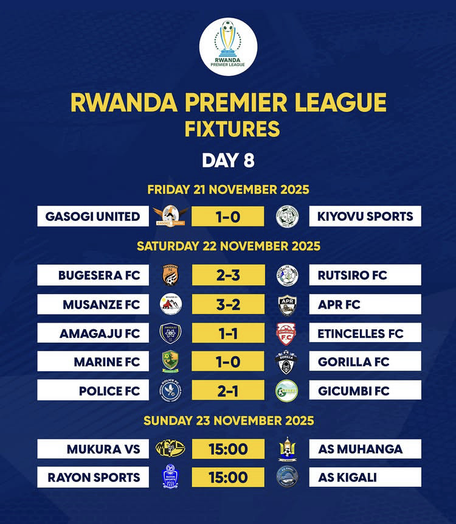

<!--more-->Kuri uyu wa Gatandatu saa cyenda z’amanywa, kuri Stade Ubworoherane i Musanze, ikipe ya Musanze FC yakiriye APR FC iyitsinda ibitego 3-2.

Uyu wari umukino w’umunsi wa 8 wa Shampiyona y’u Rwanda, watumye Musanze FC iguma ku mwanya wa kabiri n’amanota 15, mu gihe APR FC iraye ku mwanya wa gatandatu n’amanota 11.

Musanze FC yatsinze ibitego byose uko ari bitatu mu gice cya mbere cy’umukino, ibifashijwemo na Mutsinzi Charles (uzwi nka Best), Shaban Hussein na Bizimungu Omar.

Mu gice cya kabiri, APR FC yagarukanye imbaraga ishaka kunganya no gushakisha intsinzi, ariko ntibyayiha amahirwe yo kurenga ku bitego yagombaga kwishyura. Yabashije gutahukana ibitego bibiri, ariko icya gatatu cyari kuyigira amahirwe yo kunganya kirayibura, bituma itsindirwa i Musanze.

APR FC imaze imyaka 6 yikurikiranya itwara Shampiyona y’u Rwanda, ariko uyu mwaka ikomeje gukomwa mu nkokora mu rugamba rwo kongera kwisubiza igikombe. Umutoza Taleb yavuze ko kimwe mu byatumye umukino uba umukoro ku ikipe ye ari uko ikibuga cyari kinyereye kubera imvura yari imaze kugwa.

\[caption id="attachment\_1525" align="alignleft" width="750"\] Uko umunsi wa munani wa shampiyona uhagaze\[/caption\]

Mutoni Divine / African Updates
