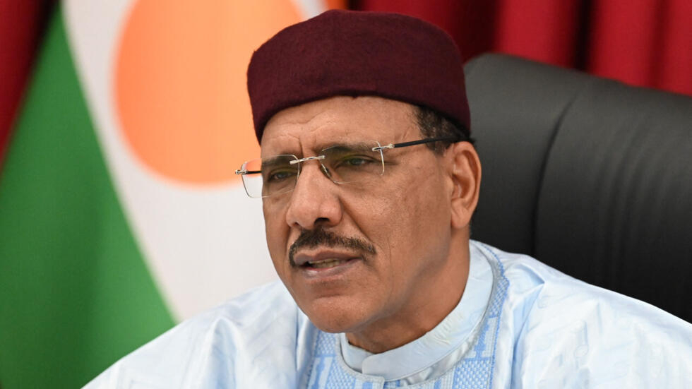

Mohamed Bazoum wahoze ayobora Niger yagerageje gutoroka aho afungiye afatwa atarabigeraho.

Ibyo byatangajwe n’ubuyobozi bw’igisirikare kiyoboye mu nzibacyuho bavuga ko ibyo byabaye kuri uyu wa kane nkuko byashimangiwe n'umuvugizi wabo bwana Amadou Abdramane, yavuze ko bamwe mu bari bamufashije bahise batabwa muri yombi ndetse ubu ngo iperereza ryatangiye ngo hamenyekkane icyibyihishe inyuma .

Icyakora amakuru yamaze kujya hanze avuga ko ngo gahunda ye yari ukubanza agashaka aho aba yihishe I Niamey muri Niger nyuma agahunga igihugu anyuze muri kajugujugu.

Kuva yahirikwa ku butegetsi Bazoum n’umugore we ndetse n’umwana we bafungiye mu ngoro y’umukuru w’igihugu. mu bihe bitandukanye abaganga ndetse n'abandi bantu bamugezeho bagaragaje ko ubuzima bwe budahagaze nabi ndetse ahabwa iby’ibanze nkenerwa nubwo ku ikubutiro byavuzwe ko ntabyo kurya bihagije babonaga.

Kugerageza gutoroka kandi bije nyuma y’iminsi mike ingabo z’ubufaransa zivuye muri icyo gihugu.

