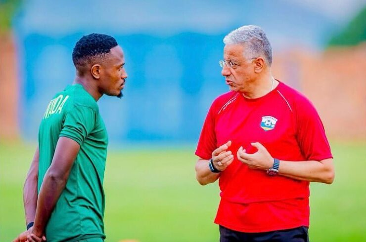
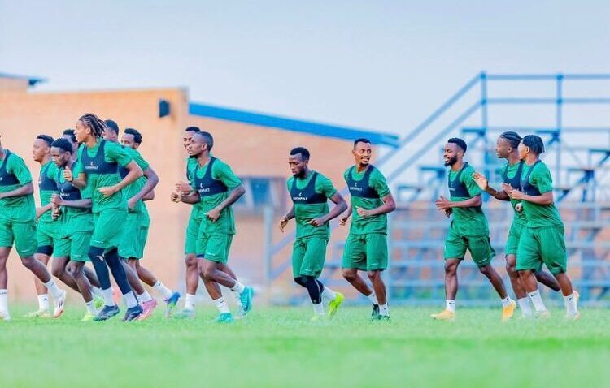

Kuri uyu wa Kabiri, tariki ya 14/10/2025 saa kumi n’ebyiri z’umugoroba, ikipe y’u Rwanda  ‘Amavubi’ izacakirana n’iya Afurika y’Epfo (Bafana Bafana) mu mukino ukomeye wo gusoza urugendo rwo gushaka itike y’Igikombe cy’Isi cya 2026. Uyu mukino uteganyijwe kubera kuri Mbolela Stadium, iherereye mu burasirazuba bwa Afurika y’Epfo, ukaba utegerejwe n’abakunzi ba ruhago mu Rwanda no hanze yarwo.

Umutoza mukuru w’Amavubi, Adel Amrouche, yatangaje ko ikipe ye iri mu myiteguro ya nyuma kandi yiteguye guhatana ngo bazitabire imikino y’igikombe cy’isi.

N’ubwo Amavubi yatsinda uyu mukino, amahirwe yo kugera mu gikombe cy’Isi yarushijeho kuba make, ubwo yatsindwaga mu mukino iherutse gukina n’ikipe y’igihugu ya Benin wabereye kuri Stade Amahoro, I Kigali. Icyakora nubwo abakunzi b’Amavubi basa nk’abacitse intege, abakinnyi n'abatoza baravuga ko bashaka gusoza neza no kwereka abafana ko bafite ubushobozi.

Abakurikirana iby’umupira w’amaguru bavuga ko uyu mukino ushobora no kuba umwanya wo kugerageza abakinnyi bashya, kongera icyizere mu ikipe no gutangira gutekereza ku mikino y’andi marushanwa ari imbere, cyane cyane CAN na CHAN.

**Divine Mutoni / African Updates**
