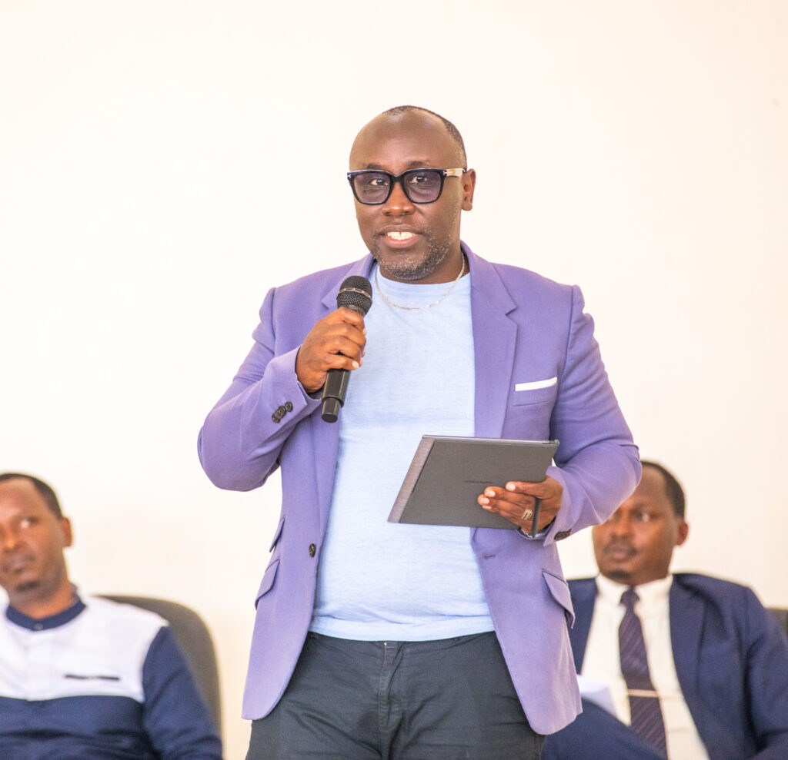
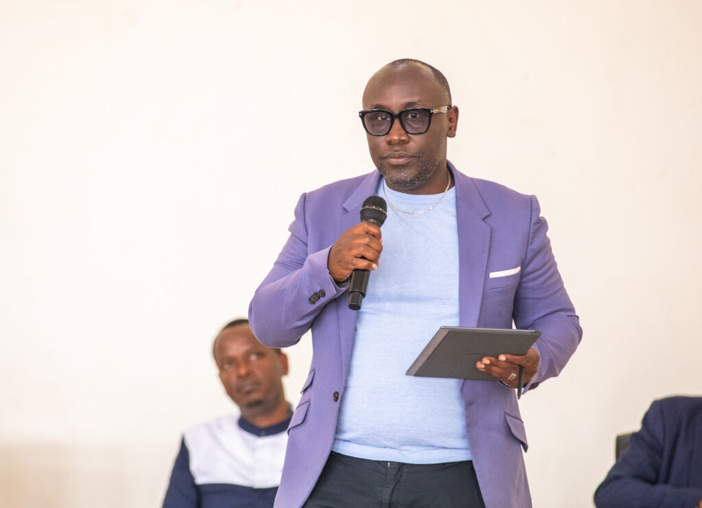
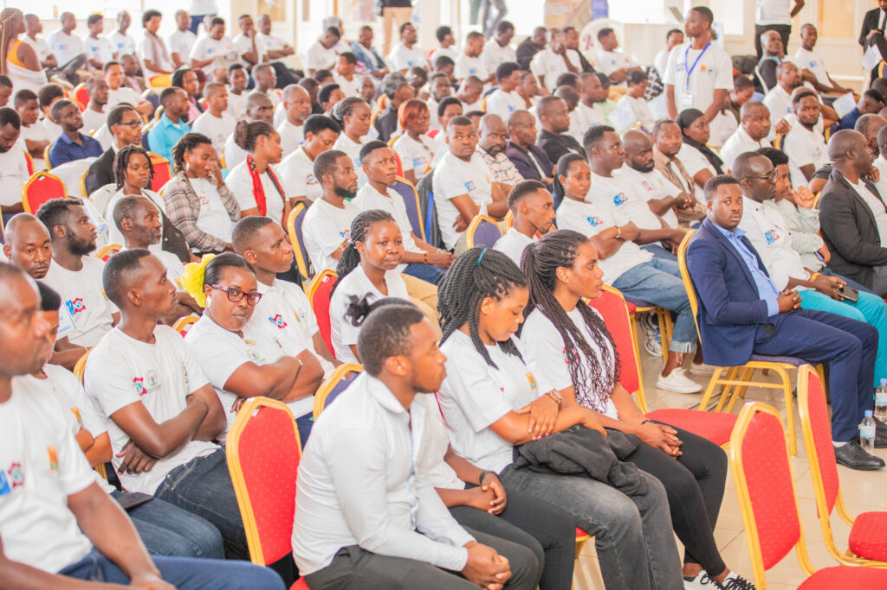
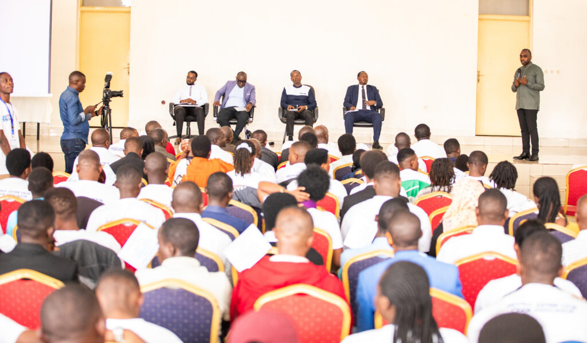

Kuva tariki ya 6 Ukwakira 2025, abakora ibikomoka ku mpu hirya no hino mu gihugu bari mu mahugurwa yateguwe na Minisiteri y’Ubucuruzi n’Inganda (MINICOM), ahuriwemo abasaga 600. Aya mahugurwa yasojwe ku wa Gatanu, agamije guteza imbere ubuziranenge n’ubucuruzi bujyanye n’igihe.

Bwana Twahirwa Christian, Umuyobozi ushinzwe guteza imbere inganda no kwihangira imirimo muri MINICOM, yavuze ko aya mahugurwa ari igisubizo kirambye kuko uru rwego rwakoraga rudafite ubunyamwuga buhagije.Yagize ati:

“Bahuguwe ku ngingo zitandukanye: gucunga business, uko basora, uko bacunga imari, uko bandika ibyo bakoze mu bitabo by’imari. Ni mu rwego rwo kubafasha kugira ubumenyi bwo guhangana ku isoko, bakabasha no kwisabira inguzanyo muri banki zitandukanye. Kugira ngo babigereho bagomba kubahiriza amategeko harimo no kwandika books of account n’ibindi.”

Abitabiriye amahugurwa batangaje ko bizeye impinduka ku mikorere yabo, kuva mu miyoborere ya company zigashingwa mu mucyo, kugeza ku gicuruzwa gifite agaciro ku isoko ry’imbere mu gihugu no hanze yacyo. Benshi bavuga ko ubu bafite icyizere cyo guhangana ku rwego mpuzamahanga, kuko bamenye uko batunganya ibikomoka ku mpu mu buryo bujyanye n’amabwiriza y’ubuziranenge, ndetse no kubona amasoko binyuze mu matsinda ndetse no mu mabanki.

Bwana Twahirwa yatangaje ko Leta ifite gahunda yo guhuza amahuriro abiri akora muri uru rwego kugira ngo hashyirweho chamber yihariye ireba ibikomoka ku mpu, izorohereza imikoranire na Leta no kubaka amahirwe yo kwiteza imbere.Yagize ati:

_“Tugiye gushyiraho chamber ireba by’umwihariko ibikomoka ku mpu. Ni muri urwo rwego twumva ko kubagira association imwe bizafasha igihugu na bo ubwabo bikabafasha kuko bahuriza hamwe imbaraga zabo.”_

Nubwo hari hateganyijwe amatora ya komite izabahuza, byasubitswe kuko hari ibitaranozwa neza nk’uko Minisiteri y’ubucuruzi n’inganda yabitangaje ndetse Gahunda yo kuyasubukura izatangazwa nyuma yo kunoza ibisabwa byose.

Ku mugabane wa Africa, urwego rutunganya ibikomoka ku mpu (leather value chain) rugenda ruhabwa agaciro mu bukungu, cyane cyane binyuze muri gahunda y’isoko rusange rya AfCFTA.

Imibare n’amahirwe igaragaza ko Africa itanga hagati ya 7-10% by’uruhu rwo ku isi, ariko itunganya munsi ya 4% byarwo mu buryo bugezweho.

Ibihugu nka Ethiopia, Nigeria, Uganda, Kenya na Afurika y’Epfo biri imbere mu gutunganya uruhu n’ibicuruzwa nk’inkweto, imikandara n’ibindi bikomoka ku mpu.

Inyigo za _AfCFTA_ zerekana ko ubucuruzi bw’ibikomoka ku mpu bushobora kwinjiriza Africa miliyari zisaga 5$ buri mwaka mu gihe bwanozwa neza.

Amahugurwa yasojwe ku wa Gatanu ni imwe mu ntambwe zifatika zo guhindura urwego rw’ibikomoka ku mpu mu Rwanda no kurufasha kugera ku ruhando mpuzamahanga. Kunoza imikorere, gushyiraho chamber imwe, no kwagura ubucuruzi binyuze mu isoko rusange rya Africa bifatwa nk’isura nshya izazamura ubukungu bw’ababikora n’igihugu cy’u Rwanda muri rusange.

**African Updates**
