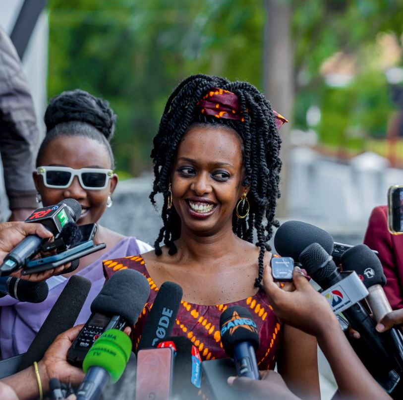
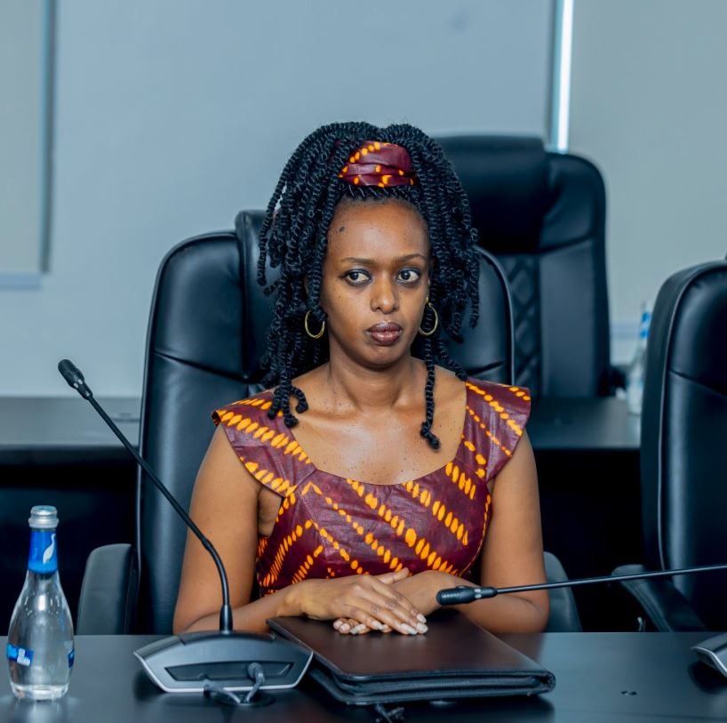
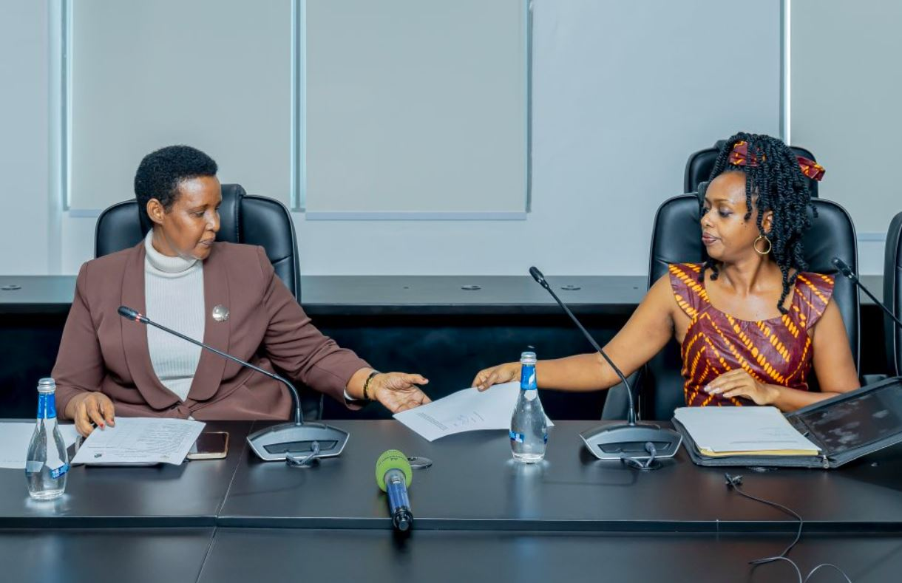
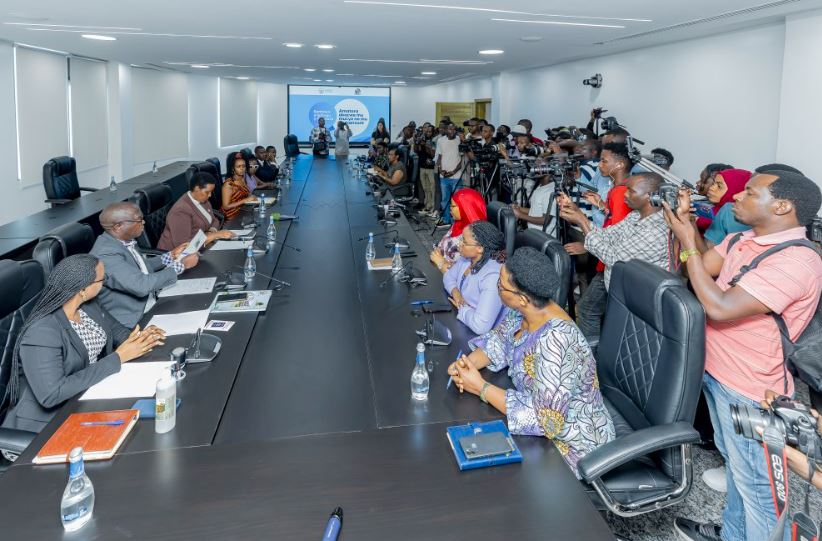
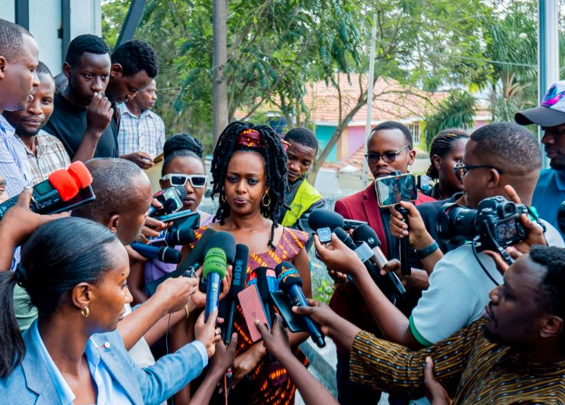

Diane Shima Rwigara wifuza kuba umukandida wigenga mu matora y’Umukuru w’Igihugu ategerejwe muri Nyakanga 2024, yashyikirije Komisiyo y’Igihugu y’Amatora kandidatire.

Ni igikorwa cyabaye kuri uyu wa kane tariki ya 30 Gicurasi 2024 Kuri Komisiyo y'igihugu y'amatora NEC, akaba ari nawo munsi wa nyuma wo kwakira kandidatire ku bifuza kwiyamamaza ku mwanya wa Perezida wa Repubulika no ku mwanya w’umudepite.

Mu byangombwa bisabwa yatanze ibaruwa itanga kandidatire, umwirondoro, ikimenyetso kimuranga gishyirwa ku rupapuro rw’itora, ilisiti y’abantu 600 bashyigikiye kandidatire ye, inyandiko y’ukuri, icyemezo cy’ubwenegihugu Nyarwanda bw’inkomoko, Amafoto abiri magufi na fotokopi y’ikarita ndangamuntu, Hari kandi icyemezo cy’amavuko n’icyemezo cyerekana ko umuntu yakatiwe cyangwa atakatiwe n’inkiko.

Mu byo asabwa hari ibyemezo atari afite birimo inyandiko y’umukandida yemeza ko nta bundi bwenegihugu yari afite cyangwa yaretse ubwo yari afite n’icyemezo gitangwa na muganga wemewe.

Diane Rwigara Yavuze ko yizeye ko kandidatire ye izemerwa kandi ko mu kwiyamamaza yiteguye gushyira imbaraga nyinshi mu guteza imbere imikorere by’umwihariko abantu bikorera ku giti cyabo.

Yavuze ko agereranyije na 2017, kuri ubu urugendo rwo gushaka imikono y’abashyigikiye kandidatire ye rwagenze neza ndetse ubu yatanze imikono y’abantu barenga 900 mu gihe mu 2017 yari yatanze abantu barenga 1200.

Diane Rwigara Yatangaje ko yizeye ko kandidatire ye izemerwa kandi ko mu kwiyamamaza yiteguye gushyira imbaraga nyinshi mu guteza imbere imikorere by’umwihariko abantu bikorera ku giti cyabo.

Diane Rwigara yigeze gushaka kwiyamamaza mu 2017 ariko biza kugaragara ko atujuje ibisabwa abakandida bigenga.

Kugeza ubu niwe wa mbee w’igitsinagore utanzze kandidatire ku mwanya w’umukuru w’igihugu. Naho abantu 6 nibo bagaragaje ko bifuza kwiyamamariza umwanya w’umukuru w’igihugu mu matora ateganyijwe kuba muri Nyakanga 2024.

Biteganijwe ko tariki ya 14 Kamena 2024 aribwo hazatangazwa lisiti ntakuka y’abakandida bemejwe.

****

****

 

**African Updates**
