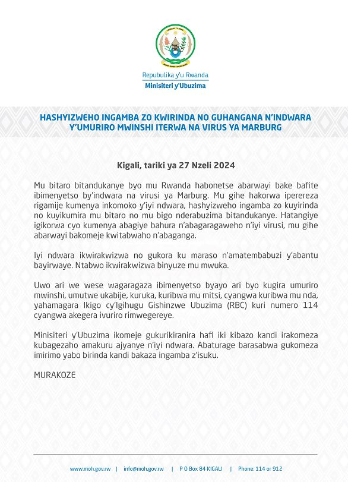

Minisiteri y'ubuzima mu Rwanda MINISANTE, yashyizeho ingamba zo kwirinda no guhangana n'indwara y'umuriro mwinshi iterwa na virusi ya marburg.

Iri tangazo ryasohotse kuwa gatanu tariki ya 27, nzeri, 2024. rivuga ko bitewe n'uko mu bitaro bitandukanye byo mu Rwanda habonetse abarwayi bafite ibimenyetso by'indwara na virusi na Marburg hatangiye igikorwa cyo kumenya abagiye bahura n'abagaragaweho n'iyi virusi, mu ihe abarwayi bakomeje kwitabwaho n'abaganga.

Iri tangazo rikomeza rivuga ko hari gukorwa iperereza rigamije kumenya inkomoko y'iyi ndwara ndetse ubu hashyizweho ingamba zo kuyirinda no kuyikumira mu bitaro no mu bigo nderabuzima bitandukanye.

Iyi ndwara ikwirakwizwa no gukora ku maraso n'amatembabuzi y'abantu bayirwaye. Ntago ikwirakwizwa binyuze mu mwuka.

ibimenyetso byayo ni ukugira umuriro mwinshi, umutwe ukabije, kuruka, kuribwa mu mitsi, cyangwa kuribwa mu nda. Ugaragaza ibi bimenyetso yahamagara ikigo cy'igihugu gishinzwe ubuzima (RBC) kuri numero 114 cyangwa akegera ivuriro rimwegereye.

Minisiteri y'ubuzima yasabye abaturage gukomeza imirimo yabo birinda kandi bakaza ingamba z'isuku.

