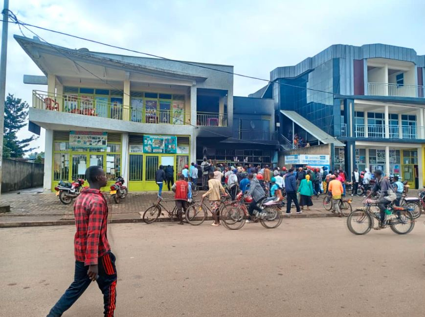
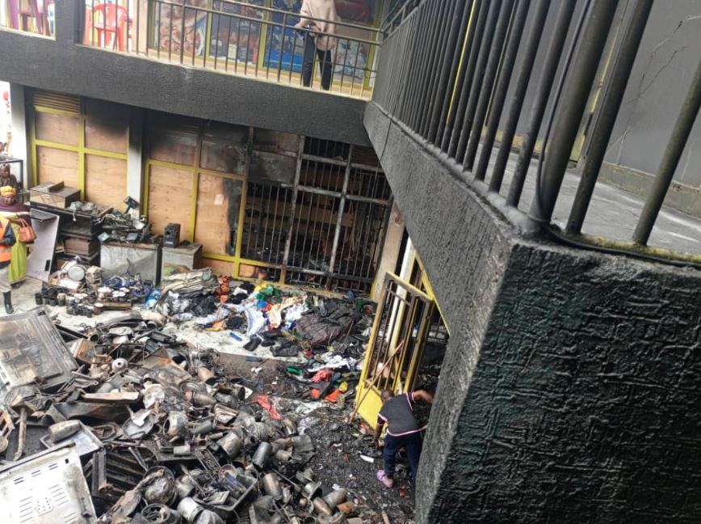

Mu ijoro ryo ku wa kabiri rishyira ku wa gatatu, inkongi y’umuriro yafashe inzu ebyiri z’ubucuruzi mu mujyi wa Huye, ahazwi nko mu Cyarabu, yangiza ibintu byinshi bifite agaciro k'amafaranga arenga miliyoni 200 Frw.

Amakuru atangazwa n’ababonye uko byagenze aravuga ko inkongi yatangiye mu masaha ya saa yine z’ijoro. Abari aho bavuga ko iyo hatabaho gutabara kwa kizimyamoto, nta n’igice na kimwe cy’izo nyubako cyari gusigara kidakongotse.

Umwe mu bacuruzi ukorera muri imwe muri izo nyubako, ariko mu gice kitagezwemo n’inkongi, yavuze ati:  
_"Nari mvuye kureba umupira, bampamagara bambwira ko amaduka ari gushya. Polisi na kizimyamoto bari batarahagera, amazi yarashize basubirayo, basubiye basanga umuriro wamaze gufata ahandi. Nta wari gukiza na kimwe."_

Yongeyeho ko ibintu byose byakaga cyane, ndetse hari n’ibiturika byumvikanaga.

Mu gihe bamwe mu bacuruzi bavuga ko inkongi yaturutse ku mashanyarazi, ubuyobozi bw'ikigo gishinzwe ingufu n'amashanyarazi,REG, burabihakana. Omar Kambanda, uyobora ikshami rya REG mu karere ka Huye yavuze ko nta bimenyetso barabona byerekana ko inkongi yaturutse kuri ‘cash power’ cyangwa ‘fusible’, kuko byose basanze bikiri bizima.

Ibyo binashimangirwa n’umuzamu witwa Jean Damascène Havugimana, wavuze ko mugenzi we yumvise ikintu giturika mbere y’uko umuriro utangira kugaragara.

Nyiri iduka ryatangiriyemo inkongi yavuze ko ibicuruzwa bye byashiriye mu muriro, birimo televiziyo zigezweho (flat screen) zigura miliyoni 1.2 buri imwe, amafirigo agera kuri 60, utwuma dusya ibiribwa (blender), iminzani, amasuka, n’ibikoresho bitandukanye byo mu gikoni. Yavuze ko nta ubwishingizi bw'ibicuruzwa yari afite ku bicuruzwa.

Ibindi byangiritse birimo amaduka acuruza imyenda, moto, ibiryamirwa n’ibiringiti. Hari na resitora yakorera  mu kindi cyumba cy’indi nyubako, yagezweho n'iyo nkongi.

 

**African Updates**
