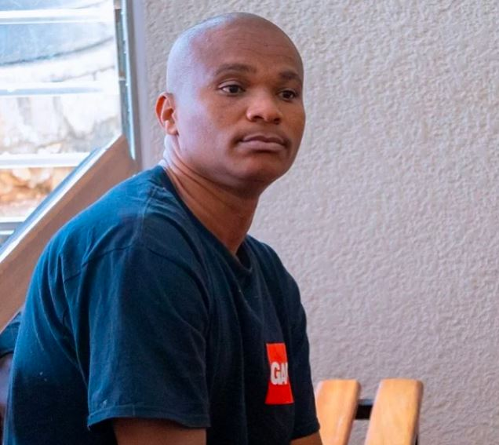

Urukiko rwisumbuye rwa Nyarugenge, rwahamije Kazungu Denis ibyaha byose ashinjwa uko ari 10, rumukatira igifungo cya burundu.

Iki cyemezo cyafashwe kuri uyu wa 8 Werurwe 2024, aho Kazungu yahamijwe ibyaha icumi birimo kwica ku bushake, gusambanya ku gahato, iyicarubozo, kwinjira mu makuru ya mudasobwa cyangwa uruhererekane rwa mudasobwa mu buryo bunyuranyije n’amategeko, guhisha umurambo, gukoresha ibikangisho no gufungira umuntu ahatemewe.

Mu rubanza rwari rwabaye tariki ya 9 Gashyantare 2024, Ubushinjacyaha bwasabye urukiko guhamya Kazungu ibi byaha byose, hanyuma rukamukatira igifungo cya burundu, cibwa n’ihazabu ya miliyoni 10 Frw.

Kazungu yemeye ibi byaha byose, ati "ibyo Ubushinjacyaha bundega ntacyo narenzaho", asaba urukiko kumworohereza igihano, abishingiye ku kuba yaratanze amakuru yari akenewe mu gihe cy’iperereza.

\[caption id="attachment\_1123" align="alignnone" width="636"\] Kazungu Dennis ubwo yari yitabye urukiko aburana ku ifungwa n'ifungurwa ry'agateganyo, 2023.\[/caption\]

Kazungu yasobanuye ko yakoze ibi byaha wenyine, ahamya ko yabikoranye ubunyamaswa kandi nta gisobanuro na kimwe yabona ku cyo yari agamije kuko atarakennye ku buryo byakwitwa ko yashakaga amaramuko.

Kazungu yatawe muri yombi muri Nzeri 2023 ubwo abagenzacyaha bavumburaga umwobo wari mu gikoni cy’aho yari acumbitse avuga ko yatabyemo mu karere ka kicukiro,  Umurenge wa Kanombe, mu kagari ka Busanza.

**African Updates**
