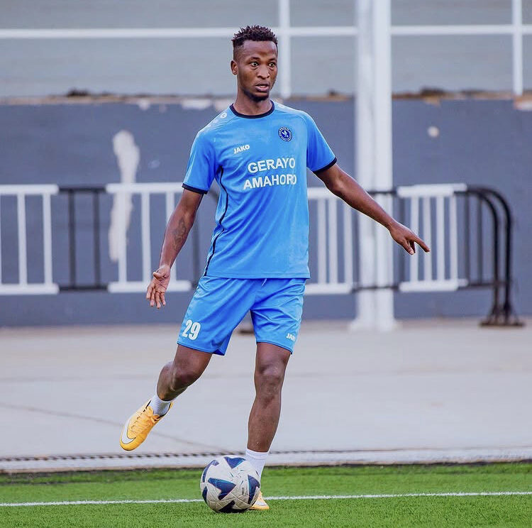

Nyuma y’imyaka itatu umunyezamu Kwizera Olivier adahamagarwa mu ikipe y’igihugu Amavubi, umutoza Adel Amrouche yongeye kumugirira icyizere.

Kwizera Olivier, waherukaga guhamagarwa muri Kamena 2022, kuri ubu yatangiye umwiherero hamwe n’abandi bakinnyi bakina imbere mu gihugu, nubwo ubu nta kipe abarizwamo.

Umwiherero w’ikipe y’igihugu watangiye kuri uyu wa 12 Ugushyingo 2025, biteganyijwe ko uzasozwa ku wa 16 Ugushyingo, aho bazibanda ku myitozo yerekeye ubumenyi bwa tekinike.

Bamwe mu bandi bakinnyi bahamagawe barimo Ishimwe Pierre na Niyongira Patience, bafatanya na Kwizera Olivier mu kurinda izamu ry’Amavubi.

Abakinnyi bakina inyuma ni; Niyigena Clément, Nshimiyimana Yunusu, Ishimwe Abdul, Mutijima Gilbert, Niyomugabo Claude, Ishimwe Christian, Byiringiro Jean Gilbert, na Ntwari Assuman.

Hagati mu kibuga hazaba harimo Nisingizwe Christian, Ntirushwa Aimé, Ruboneka Jean Bosco, Kwitonda Alain, Niyo David, Nsanzimfura Keddy, Twizeyimana Innocent, na Uwizeyimana Innocent.

Abasatira imbere ni Mugisha Gilbert, Mugisha Didier, Uwineza René, Ishimwe Djabil, Sindi Jesus Paul, na Rudasingwa Prince.

Biteganyijwe kandi ko hazaba umukino wa gicuti uzahuza aba basore b’Amavubi n’ikipe ya Al Hilal S.C yo muri Sudani, ubu iri mu gihugu cy’u Rwanda.

\[caption id="attachment\_1511" align="alignnone" width="750"\] Byiringiro Lague ukinira ikipe ya Police FC ntabwo yahamagawe\[/caption\]

**Divine Mutoni / African Updates**
