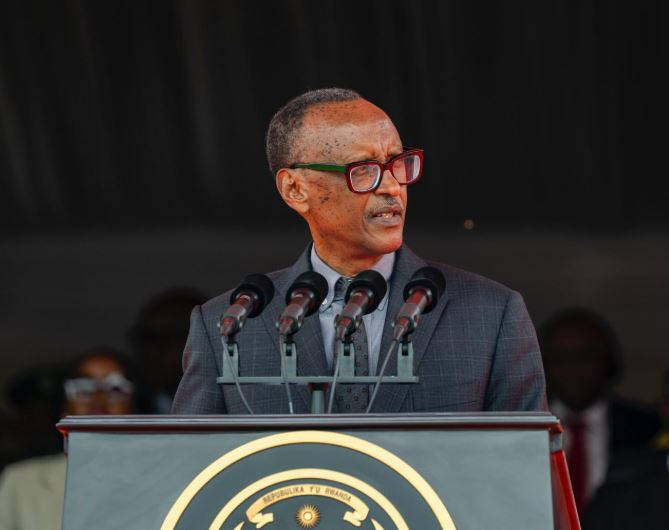
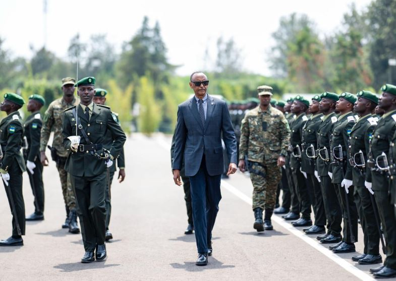
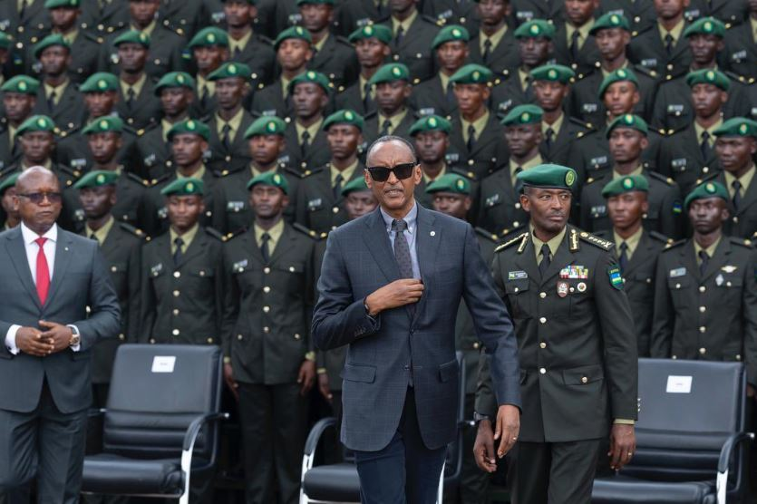
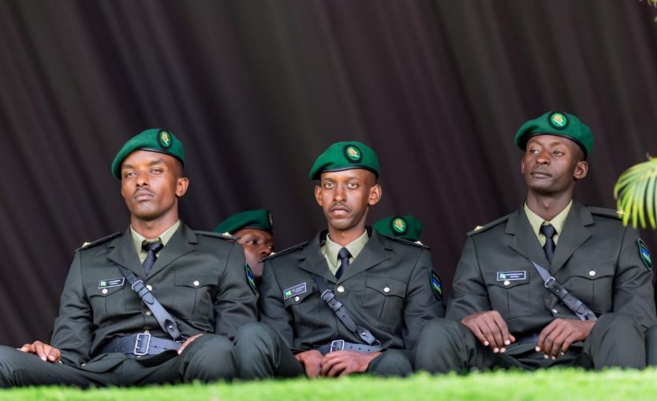

Kuri uyu wa Gatanu Tariki ya 03, U kwakira 2025, abasirikare 1,029 barangije amasomo ku rwego rwa ofisiye bahawe ipeti rya _Sous-Lieutenant_ na Perezida wa Repubulika Paul Kagame, akaba n’Umugaba w’Ikirenga w’Ingabo z’u Rwanda (RDF).

Uyu muhango wabereye mu Ishuri rya Gisirikare rya Gako, mu karere ka Bugesera. wanahujwe no kwizihiza imyaka 25 iri shuri rimaze ritanga ubumenyi ku rwego rwa ofisiye.

Aba bahawe ipeti bari mu byiciro bine (4) bitandukanye harimo Abasoje amasomo y’imyaka 4, Abasoje umwaka 1, Abasoje amezi 8 n’abaturutse hanze y'u Rwanda

Ba ofisiye binjiye muri RDF biyerekanye mu buryo bwihariye binyuze mu gushushanya imibare ifite ibisobanuro bitandukanye. Baserutse bagaragaza icyiciro cya 12 cy'abanyeshuri basoje uyu munsi ndetse n'umubare w'ibyiciro byasoje mbere. Banditse umubare wa 2000, ugaragaza igihe icyiciro cya mbere cya ba ofisiye cyasoje muri iri shuri. Bananditse 2025 nk'umwaka basojemo amasomo ndetse na 25 nk'imyaka ishize Ishuri rya Gisirikare rya Gako ritangiye gutanga ubumenyi mu bya gisirikare.

Mu ijambo rye, Perezida wa Repubulika y’u Rwanda Paul Kagame, akaba n’Umugaba w’Ikirenga w’Ingabo z’u Rwanda (RDF) yashimiye abarangije amasomo anabibutsa ko ipeti bahawe ari intangiriro y’urugendo rwo kurinda igihugu_._

Yabasabye Kwitwararika bakazirikana indangagaciro za gisirikare, Kwiyubakira ubushobozi bwo guhangana n’isi ihinduka buri gihe, Kwirinda ibiyobyabwenge, ubusinzi n’imyitwarire mibi ishobora kubambura icyubahiro cy’akazi kabo. Yagize ati:

“Ahazaza h’u Rwanda hari mu biganza byanyu. Turashaka amahoro, kandi kuyabona bisaba abantu biteguye kwitanga.”

Perezida Kagame yashimye uruhare rw’ababyeyi n’imiryango bashyigikiye aba basirikare mu rugendo rwabo, abibutsa ko ukorera igihugu aba yikorera we n’umuryango we.

Brian Kagame, bucura bwa Perezida Paul Kagame na Madamu Jeannette Kagame, ari mu bofisiye bato binjiye mu Ngabo z’u Rwanda, aho yasoje amasomo ya gisirikare mu ishuri rya Sandhurst Military Academy mu Bwongereza.

 

**African Updates**
