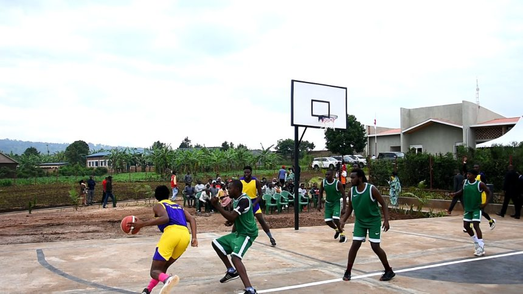
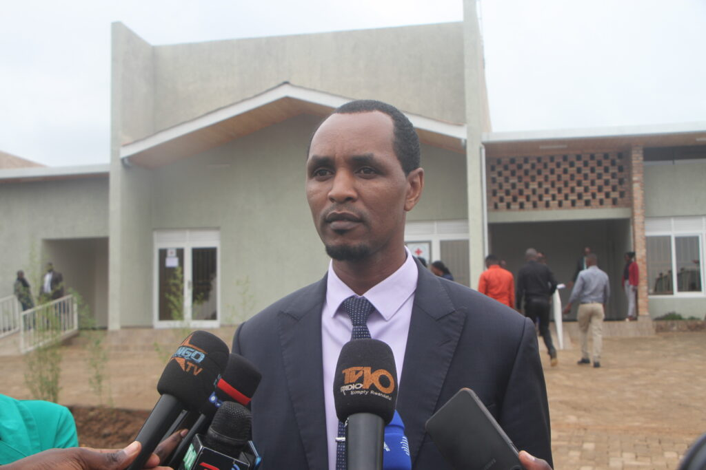
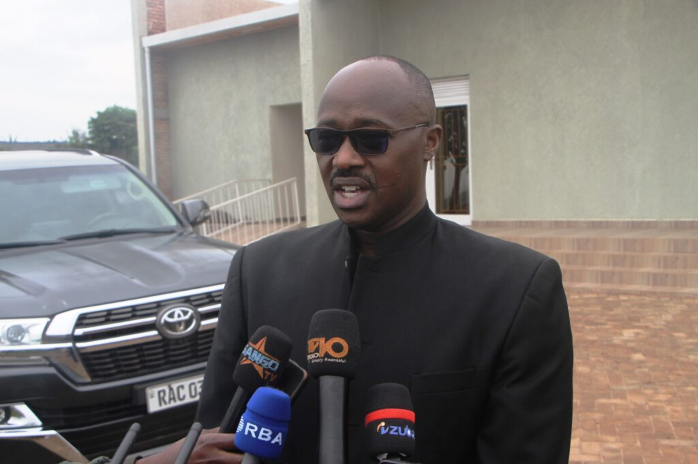
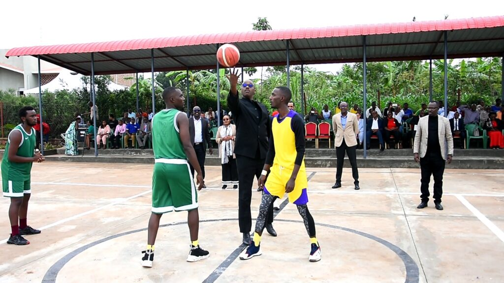
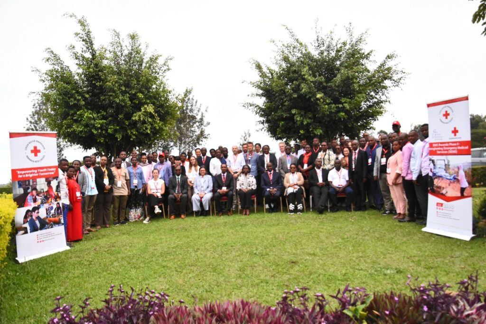
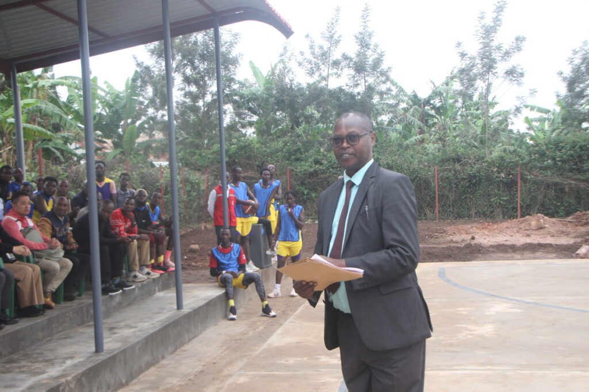

On Thursday, November 21, 2024, the Rwanda Red Cross, alongside local stakeholders, celebrated the grand opening of the much-anticipated Youth Center in Mwurire Sector, Rwamagana District. The ribbon-cutting ceremony, which marked the culmination of months of planning and construction, was officiated by the Governor of the Eastern Province, Pudence Rubingisa, during a three-day collaborative meeting between the Rwanda Red Cross and its key partners.

The Youth Center, which was built with the generous support of the Belgium Red Cross, is designed to tackle pressing issues facing the region’s young population. Aimed at fostering development and providing essential services, the center boasts a range of facilities, including training rooms, spaces for reproductive health education, trauma counseling services, ICT resources, and sports amenities.

Local youth expressed overwhelming enthusiasm about the potential of the new center to positively impact their lives. Grace Uwimana, a local youth member, shared her excitement, stating, “Having these services right here in our community is a huge relief. It will help us avoid distractions that could derail our future. With such resources now close by, our development will happen much faster.”

Echoing this sentiment, Thomas Nshimiyimana, another local youth, emphasized the center’s role in promoting healthy habits and preventing negative behaviors. “With sports facilities nearby, we no longer have to travel far for recreation. This will protect us from idleness and keep us from falling into harmful activities like substance abuse,” he said.

\[caption id="attachment\_1317" align="alignnone" width="860"\] Youth playing basketball\[/caption\]

 

The Rwanda Red Cross initiated the project to respond to the numerous challenges faced by young people in the region, such as drug abuse, early pregnancies, and mental health issues.

The President of the Rwanda Red Cross, Karasira Wilson, highlighted the importance of empowering youth. “Young people are the future of our nation, but they also face many obstacles. This center is our contribution to helping them overcome these challenges and make a positive impact on the nation’s growth,” he explained.

\[caption id="attachment\_1316" align="alignnone" width="1024"\] KARASIRA Wilson, The President of Red Cross - Rwanda\[/caption\]

 

Governor Pudence Rubingisa praised the center’s potential to transform the local community. “This facility is more than just a building; it is a beacon of hope and a powerful tool for change. It aligns perfectly with our national goals of promoting sports, recreation, and community development. I urge all youth in the region to make the most of the opportunities this center offers.”

He also called on local residents to actively support the initiative: “This is a community project, and it is vital that parents and guardians encourage their children to participate in the programs. Together, we must take ownership of this infrastructure and ensure it thrives.”

\[caption id="attachment\_1321" align="alignnone" width="1024"\] Pudence Rubingisa, The Governor of Eastern Province - Rwanda\[/caption\]

The Youth Center is set to become a pivotal resource in the region, offering much-needed support in education, recreation, and personal development. By providing a safe space for learning and growth, it aims to empower young people to build a brighter future for themselves and for Rwanda.

 

\[caption id="attachment\_1320" align="alignnone" width="1024"\] Mazimpaka Emmanuel, Red Cross - Rwanda\[/caption\]

 

 

**African Updates**
