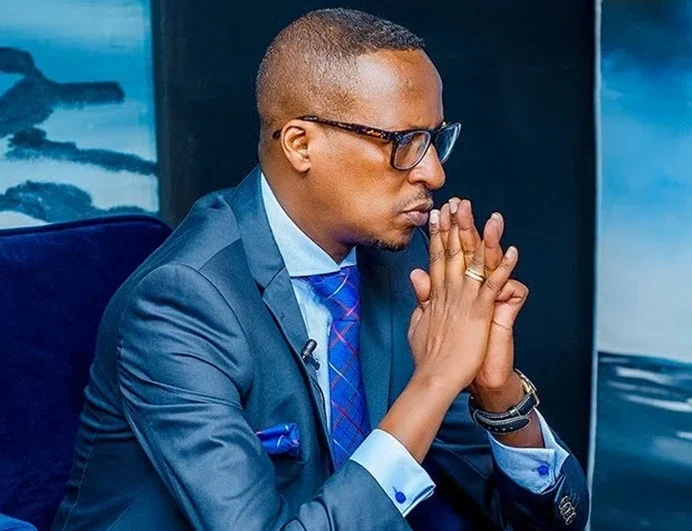

Umunyamakuru Jean Lambert Gatare wari umaze igihe mu mwuga w’itangazamakuru mu Rwanda, yitabye Imana azize uburwayi.

Jean Lambert Gatare yitabye Imana mu ijoro ryo kuwa gatanu rishyira kuri uyu wa Gatandatu, aguye mu Buhinde aho yari yaragiye kwivuriza

Amakuru y’urupfu rwe yamenyekanye mu rukerera rwo kuri uyu wa Gatandatu tariki 22 Werurwe 2025 aho yari amaze iminsi yaragiye kwivuriza mu Buhinde.

Jean Lambert Gatare ni umwe mu banyamakuru bakunzwe cyane mu Rwanda, by’umwihariko mu bijyanye na siporo ndetse no kwamamaza. Yatangiye gukora kuri Radio Rwanda mu 1995. Guhera mu 2011 yatangiye gukorera Isango Star. Mu 2020 nibwo yagizwe umuyobozi w’agateganyo w’ikinyamakuru Rushyashya.

Gatare ni umwe mu batanze umusanzu ukomeye mu itangazamakuru rya Siporo, haba mu kogeza umupira no kuvuga amakuru y’imikino, akagira indi mpano yihariye yo kwita abakinnyi amazina bitewe n’imyitwarire yabo mu kibuga. bamwe mubo yise amazina, harimo Haruna yise Fabregas , Bokota yise igikurankota, Ndayishimiye Eric yise Bakame, ndetse n’abandi.

\[caption id="attachment\_1358" align="alignnone" width="692"\] Umunyamakuru Jean Lambert Gatare yitabye Imana\[/caption\]

**African Updates**
