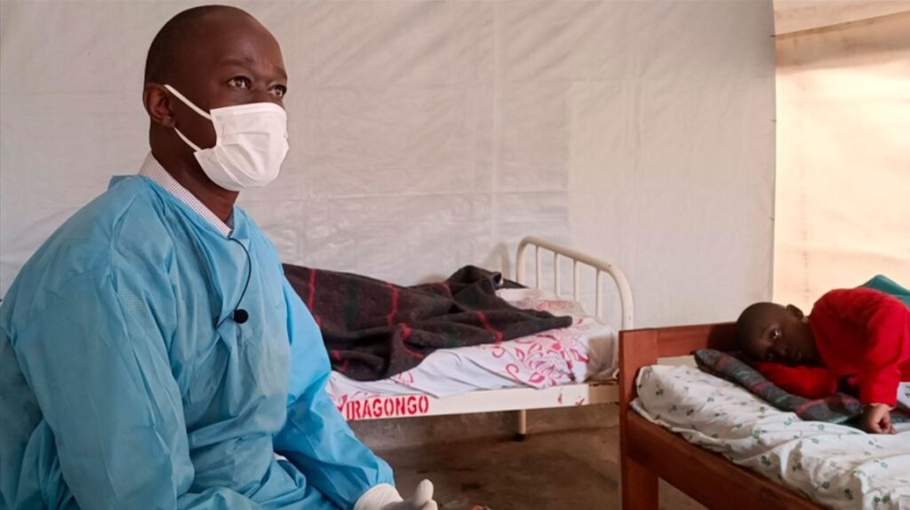

Ishami ry’umuryango w’abibumbye ryita ku buzima OMS, ryatangaje ko abantu umunani (8) bamaze kwicwa na virusi ya Marbug mu ntara ya Kagera, mu gihugu cya Tanzania.

Itangazo rya OMS ryashyizwe ku mbuga nkoranyambaga zitandukanye rivuga ko itariki ya 10 Mutarama, 2025 aribwo bakiriye amakuru aturuka muri Tanzania agaragza ko icyorezo cya Marburg kiri guhitana abantu kandi mu gihe nta gikozwe ibintu byarushaho kuba bibi. Icyo gihe abantu batandatu nibo bari bamaze kuyandura batanu muri bo barapfuye. Nyuma yaho kuva ku itariki ya 11 mutarama, 2025 abantu icyenda barayanduye, umunani muri bo barapfa.

OMS ivuga ko abo bose imaze guhitana ari abo muri iyo ntara ya Kagera ihana imbibi n’ibihugu birimo  u Rwanda, U Burundi na Uganda.

Ibimenyetso abo barwayi bose bahurizaho birimo kubabara umutwe, kubabara umugongo, gucibwamo, kugira umuriro mwinshi, gutukura amaso, gucika intege no kuva amaraso ahantu hose hari umwenge ku mubiri mu gihe indwara igeze  kure.

Kugeza ubu abakora mu nzego z’ubuzima umubare munini woherejwe muri iyi ntara kugirango bakore iperereza kuri iki cyorezo, gukaza uburyo bwo kwirinda ndetse no gukurikirana abahuye n’abanduye kugirango bitabweho itarakwira henshi.

Aya makuru atangajwe nta minsi ibiri irashira minisiteri y’ubuzima muri Tanzania ihakane amakuru yari amaze iminsi ku mbuga nkoranyambaga avuga ko hari indwara itaramenyekana iri kwica abantu, ifite ibimenyetso bisa nk'ibya virusi ya Marburg.

Ubwa mbere iki cyorezo kigaragara muri iyi ntara hari mu mwaka wa 2013 icyo gihe abantu batandatu barapfuye.

Mu mwaka wa 2024 iki cyorezo cyagaragaye mu Rwanda kuva muri nzeri kugera mu kuboza, 2024 ubwo leta y’u Rwanda yemezaga ko cyacitse burundu. Abantu 65 bari barayanduye muri bo 15 barapfa.

**Dore uburyo bwo kwirinda virusi ya Marburg**

Inzego z’ubuzima zikangurira abantu kwirinda gukoranaho, kugira isuku no gukaraba amazi meza n’isabune kenshi. Kwirinda gukora imibonano mpuzabitsina n’umuntu uyirwaye, mu gihe ubonye ufite ibimenyetso byayo ukihutira kujya kwa muganga.

 

**African Updates**
