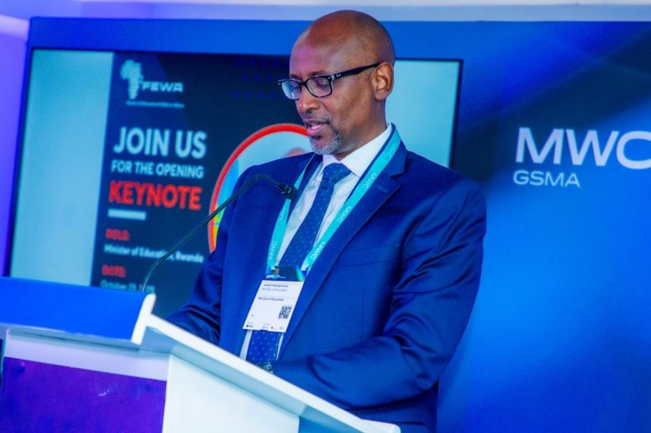
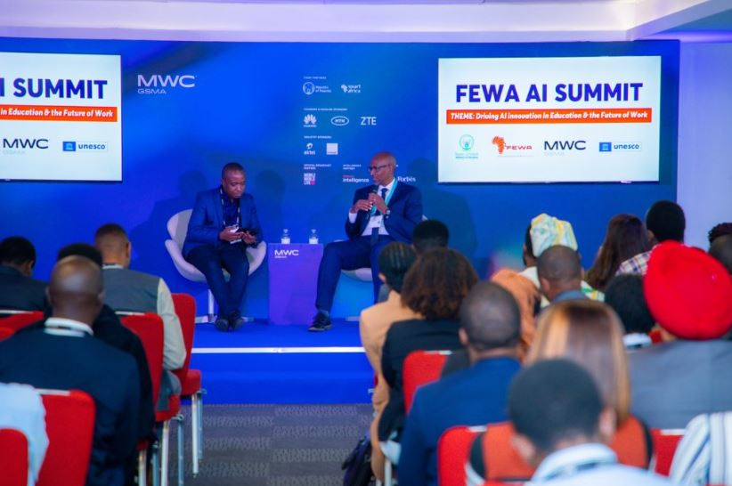

Minisiteri y’Uburezi (MINEDUC) yatangaje ko gahunda yo guhugura abarimu ku ikoreshwa ry’ikoranabuhanga ry’ubwenge buhangano (Artificial Intelligence, AI) yatangiye gushyirwa mu bikorwa, hagamijwe guteza imbere uburezi bujyanye n’igihe n’ikoranabuhanga rigezweho.

Iyi gahunda ibarizwa mu murongo mugari w’Igihugu wo guteza imbere uburezi bushingiye ku ikoranabuhanga, nk’uko biteganywa n’Icyerekezo cya 2050 ndetse na gahunda ya kabiri ya Guverinoma y’imyaka itanu (NST2), byombi bishyira imbere kongerera ubumenyi n’ubushobozi abakozi bo mu nzego zitandukanye.

Mu nama nyafurika yahuje inzobere mu ikoranabuhanga ry’ubwenge buhangano mu burezi n’iterambere ry’umurimo yabereye i Kigali ku wa Kane, tariki ya 23 Ukwakira 2025, Minisitiri w’Uburezi, Dr. Nsengimana Joseph, yavuze ko igihugu cyatangiye kwitegura guhindura uburyo bwo kwigisha n’ubwo kwiga hakoreshejwe AI.

Yagize ati: “Abarimu ni bo shingiro ry’impinduka mu burezi. Ku bufatanye n’Ikigo cya MIT RAISE n’abandi bafatanyabikorwa, twatangiye kubigisha uburyo bwo gukoresha AI, kugira ngo basobanukirwe imikorere yayo n’akamaro kayo mu kongerera ireme imyigishirize.”

Minisitiri yongeyeho ko AI izifashishwa mu gutegura amasomo, kugenzura imikorere y’abanyeshuri no kubaha ubufasha ku gihe. Yagize ati: “Niba AI igamije guhindura imyigire y’abanyeshuri, igomba no kuzana impinduka mu buryo twigishamo. Ntituyifata nk’ikoranabuhanga gusa, ahubwo nk’igikoresho cy’ingenzi mu gushyira mu bikorwa gahunda z’Igihugu z’uburezi, ubuzima, ubuhinzi n’imiyoborere.”

MINEDUC ivuga ko gushyira imbere ikoreshwa rya AI bizafasha guteza imbere uburezi buhanga amahirwe mashya y’imirimo, binyuze mu guteza imbere amasomo ya STEM (Science, Technology, Engineering and Mathematics), gahunda za TVET, n’integanyanyigisho zigaragaza ishingiro ry’ubumenyi mu bijyanye n’ikoranabuhanga n’ihangwa-bishya.

Guverinoma y’u Rwanda kandi ikomeje gushyira imbaraga mu gukwirakwiza internet mu mashuri, by’umwihariko mu byaro, kugira ngo abanyeshuri bose babashe kungukira mu ikoreshwa rya AI. Hanateganyijwe uburyo bwo gufasha abanyeshuri bafite ubumuga cyangwa ibibazo by’ururimi kugira ngo bataburizwemo n’iri koranabuhanga.

Minisiteri yashimye kandi abateguye Inama Mpuzamahanga yiga ku iterambere ry’ikoranabuhanga rya telefoni (MWC Kigali 2025) n’abandi bafatanyabikorwa baharanira ko Afurika izagira uburezi bukoresha ikoranabuhanga mu buryo bujyanye n’Isi y’ubu.

**African Updates**
