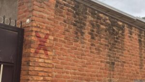

Ubuyobozi bw’Umujyi wa Kigali buravuga ko inzu zose ziriho ikimenyetso cya ‘Towa’ zigomba gusenywa ndetse ngo hari gukorwa ibishoboka ku buryo imvura iteganyijwe kugwa kuva muri Nzeri itazasanga zigihari.

Imiryango irenga ibihumbi birindwi ni yo yabarurwaga mu Mujyi wa Kigali nk’ituye ahantu hashyira ubuzima bwayo mu kaga, ibizwi nk’amanegeka.

Nyuma y’ibiza biheruka kwibasira u Rwanda muri Gicurasi 2023, bigahitana abantu 135, bikanasenya inzu 5.963 hirya no hino mu gihugu n’ibikorwaremezo bikangirika, byongeye gukangura abayobozi mu bice bitandukanye by’igihugu batangira gushishikariza abaturage kwimuka mu bice bishyira ubuzima bwabo mu kaga.

I

 

Umuyobozi w’Umujyi wa Kigali, Pudence Rubingisa, ubwo yari mu Kiganiro Urubuga rw’Itangazamakuru ku wa 20 Kanama 2023, yavuze ko kuba hakiri inzu zashyizweho ikimenyetso cyerekana ko zitemerewe guturwamo kizwi nka ‘Towa’ ari uburangare bwabayeho.

Yavuze ko hari imiryango irenga 4200 yavuye mu bice bishobora gushyira ubuzima bw’abayigize mu kaga, hasigaramo irenga 3000.

Ati “Bariya bavuyemo muri Gatsata bari bafite ‘towa’ yo kuva mu 2016. Twigeze kubivugaho ko natwe hari igihe turangara. Ubundi iyo hagiyeho towa, haba hari impamvu yagiyeho kandi ibyo byari byatewe n’imvura yaguye muri iyo myaka. Ubundi umuntu ntiyakabaye yaratuyemo, ni yo mpamvu ubu iziri kwimurwamo abantu tuzikuraho.”

Rubingisa yavuze ko abagera kuri 4200 bimutse mu manegeka biganjemo abakodeshaga bazwi nk’abapangayi, bangana na 85%.

Ati “Kubera ko benshi twabonaga ko tubatunguye ni na yo mpamvu twagize uburyo twafatanya kubageza aho bakwimukira kugira ngo bisuganye vuba.”

Ubu bukangurambaga kandi no muri iki gihe Umujyi wa Kigali urabukomeje kugira ngo imvura itazasanga abantu bakiri ahantu hashyira ubuzima bwabo mu kaga.

Umunyamakuru yamubajije niba inzu yose iriho towa izasenywa aravuga ati “Yego. Ahubwo turanagira ngo dutanguranwe n’iyi mvura, ni bwo bukangurambaga navugaga turi gukora.”

Meya Rubingisa yavuze ko Akarere gasigaranye ibice byinshi by’amanegeka ari Gasabo, mu Murenge wa Gisozi na Kimironko no mu Karere ka Nyarugenge.

Yahamije ko hari ahantu muri rusange hitwa amanegeka atari uko ari imisozi ihanamye, ahubwo ari inzu ubwayo ifite ikibazo ku buryo haramutse havuguruwe nk’uko mu Biryogo, mu kagari k’Agatare hatunganyijwe ikibazo gihita gikemuka.

Ati “Ibyo 3131 ni abo twabaruye aho hose, Kimisagara irimo, yewe na Nyabisindu ni ahantu iyo urebye hatitwa amanegeka y’umusozi, ariko inzu yonyine inegetse. ‘De Bandit’ ntabwo hakiswe mu manegeka ariko inzu ukuntu iba imeze, Biryogo twarazigiraga, hariya mu Agatare. Umushinga twahakoze wahise utuma ivanwa mu hantu hashyira ubuzima bw’abantu mu kaga.”

Yakomeje ati “Nyabisindu turi gukora umushinga umeze gutyo ariko inzu twabonye zishobora kuba zifite icyo kibazo zabaruwe muri uriya mubare. N’abo mwavuze rero bari hejuru gato Kimisagara, mu Kiderenka, ubu icyo dukora ni ukubegera umuryango ku muryango.”

Umujyi wa Kigali uvuga ko imiryango irenga 2000 ikiri mu manegeka ikodesha, ibyo bavuga ko byoroshye kuyigisha ikahava, bagasigara bigisha ba nyiri inzu kugira ngo kugira ngo bimukire ahandi.

Hari kandi kubaka za ruhurura mu bice bitandukanye no guha ubudahangarwa izihasanzwe kugira ngo zibashe kuyobora amazi ntagere mu baturage.

**Source; igihe**
