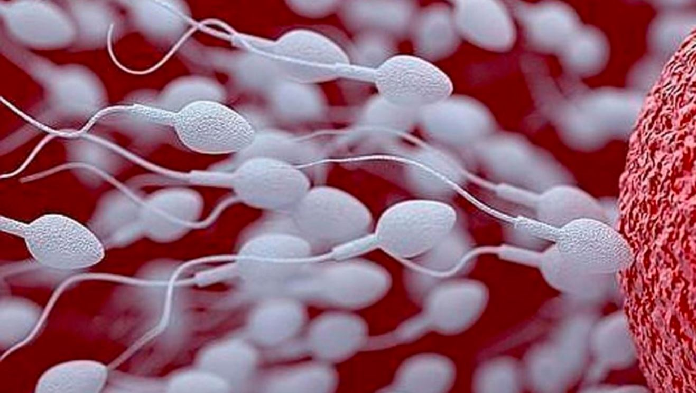

Hari benshi bibaza ku cyo abaganga bagenderaho bavuga ko umugabo afite intanga zitujuje ibisabwa akaba ari yo mpamvu atabasha gutera inda.

Mu gihe abandi biyumvisha ko baba bafite amasohoro n'intanga nkeya. N'aho abandi bakavuga ko bafite amasohoro ahagije, bityo rero kuvuga ko batabyara ari nta shingiro bifite.

Ese amasohoro n'intanga ni bimwe? Ese amasohoro agomba kuba yujuje ibiki kugirango abashe gutera inda?

Tugendeye ku bigenwa n'umuryango wita ku buzima kw'isi(WHO) byo muri 2010, amasohoro mazima ashobora gutera inda agomba kuba yujuje ibi bikurikira:

1\. Ingano (mL): hejuru ya 1.5

2\. Ubucucike bw'intanga: hejuru ya miliyoni 15 kuri buri mililitiro.

3\. Umubare wose w'intanga: hejuru ya miliyoni 39

4\. Intanga zibasha koga (%): hejuru ya 40%

5\. Intanga zibasha koga zisanga intanga ngore (%): hejuru ya 32%

6\. Intanga ziteye neza (%): hejuru ya 4%

Reka mbisobanure mu magambo yoroshye:

1\. Ingano: iyi ni ingano y'amasohoro yose yarekuwe mu gihe umugabo asohoye. Agomba kuba ari hagati ya mililitiro 1.5 na 5 (hagati y'akayiko kamwe na tubiri dushyira isukari mu cyayi). Yaba yabaye menshi akagera kuri mililitiro 7.6

2\. Umubare w'intangangabo: umubare w'intanga ziri mu masohoro. Zigomba kuba ziri hejuru ya miliyoni 39. Uyu ni umubare w'intanga ziteguye guhura n'igi.

3\. Intanga zibasha koga zisanga intanga ngore: intangangabo zose ntabwo ariko zibasha koga, n'izibasha koga ntabwo ari ko zigenda zigendera inzira imwe, hari iziba zoga ariko nta cyerekezo. Mu masohoro rero, intanga zose zirimo, nibura 32% zigomba kuba zibasha koga zifite icyerekezo ku buryo hari igi zagenda zirisanga.

4\. Intanga ziteye neza: intanga iteye neza ni ifite umutwe, igihimba n'umurizo biteye ndetse bingana uko byagakwiye kumera. Mu ntanga zose ziri mu masohoro, nibura 4% zigomba kuba ziteye uko bikwiye. ibi byerekana umubare w'intanga ziteye neza kuburyo zahura n'igi.

Muri macye iyi mibare yerekana

\- ingano y'amasohoro yakozwe

\- ingano y'intanga zihari

\- uburyo intanga zihari zishobora koga neza

\- Umubare w'intanga zifite imiterere ikwiye.

Ibi byose ni byo bifasha kumenya uburumbuke bw'umugabo n'uko ubuzima bwe bw'imyororokere buhagaze.

**Icyitonderwa**: ntabwo ushobora kwipima ngo ubimenye udakorewe ibizamini byabugenewe.

Igihe cyose wumva uhangakishijwe n'ubuzima bwawe bw'imyororokere, uge wihutira kubaza muganga uhabwe ubufasha.

**African Updates**
