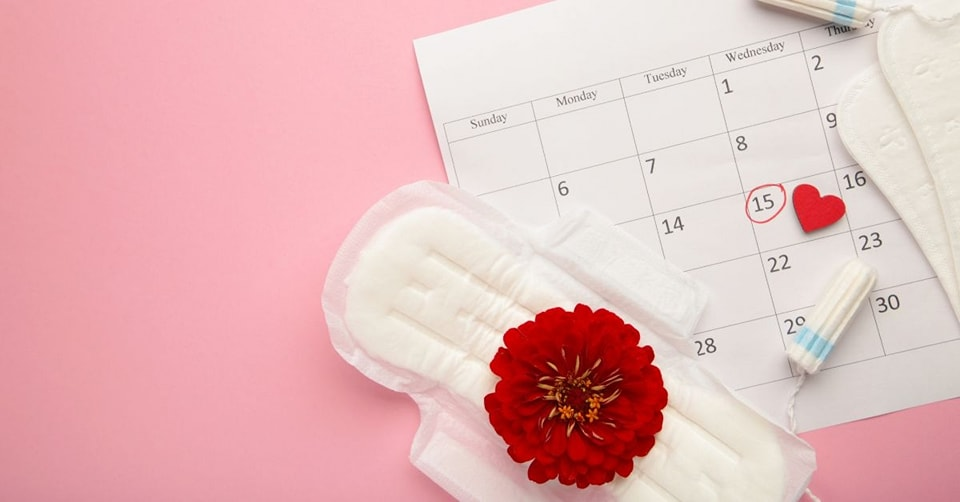
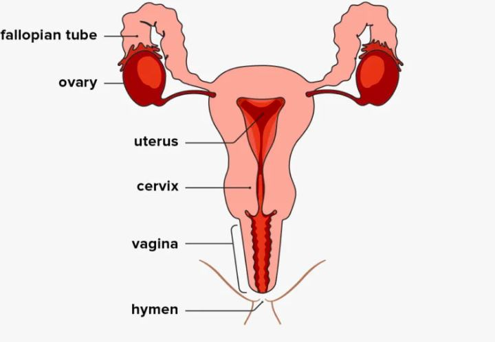

Iyo uganiriye n'abantu batandukanye yaba abagore cyangwa abagabo hari abo usanga badasobanukiwe ibijyanye n'ibihe by'imihango y'abagore bikunze kuba buri kwezi, muri iyi nkuru tugiye krebera hamwe inkomoko y'amaraso aza aho aturuka n'ikibitera.

Ubusanzwe umukobwa/umugore iyo amaze kuva, umubiri by'umwihariko muri nyababyeyi(uterus) hatangira kwiyubaka kugirango hamere uko hasanzwe, hanyuma udusabo(ovaries) tugatangira gutegura igi rizarekurwa muri uko kwezi. Ibi bifata iminsi hagati ya 14 na 21 kuva umugore atangiye imihango kugeza igi rirekuwe.

Hanyuma rero, iyo igi riri hafi kurekurwa habura iminsi micye, hiyambajwe umusemburo wa progesterone hari impinduka zidasanzwe zikorwa muri nyababyeyi. Izi mpinduka zikorwa mu kwitegura ko rya gi nirirekurwa rizahura n'intanga ngabo hakabaho gutwita. Izo mpinduka rero ni izo kwitegura kwakira inda (pregnancy).

Reka dukoreshe uru rugero: Urabona iyo uri kwitegura Abashyitsi, hari impinduka ukora iwawe nko kuba watira ibikombe, amasahane, ibiyiko, amakanya, yewe na matora wararagaho niba ari ntoya ukaba watira inini kugirango muzayikwireho mwembi, ndetse n'ibyo kurya ugateka byinshi.

Ibi nibyo bikorwa muri nyababyeyi, kubera ko haba hashobora kubaho gutwita (umushyitsi), nyababyeyi igira undi murongo wiyongeramo ufite n'imitsi iwuzanira amaraso (ni byo wagereranya na kwa gutira ibindi bikoresho, guhaha byinshi no kuzana matora nini), ibi bikorwa kugirango wa mushyitsi nahagera (gutwita) azasange witeguye.

Iyo wa mushyitsi aje, ya myiteguro wakoze igumaho ndetse hakongerwaho n'ibindi bitewe n'igihe azamara. Bivuze ko iyo rya gi rirekuwe, rigahura n'intanga ngabo, hakabaho gutwita, muri nyababyeyi haguma za mpinduka hakiyongeraho n'izindi kugeza umugore abyaye.

**Hanyuma rero, iyo wa mushyitsi wari witeguye yisubiyeho ntaze bigenda bite?** Urumva ibyo watiriye byose urabisubiza na ya matora nini ukayihindura ukisubiranira imwe ntoya usanganywe.

No muri nyababyeyi rero, iyo rya gi ryarekuwe ariko intanga ngabo ntize ngo habeho gutwita, ya myiteguro yakozwe yo kongeramo undi murongo ufite n'imitsi y'amaraso, biba ngombwa ko bikurwaho byose kugira habe uko hasanzwe hateye. Wa murongo rero iyo ukuweho, ya mitsi yawuzaniraga amaraso nayo igakurwaho niho haturuka amaraso y'imihango kubera ko amaraso ari muri ya mitsi adafite aho kubikwa. Ibi nibyo bivamo imihango, nyuma yo kuva, nyababyeyi yongera gutangira kwiyubaka.

 **None rero rya gi ni iki kiribaho?** Iyo igi ryarekuwe ariko ntirihure n'intanga ngabo, umubiri urarimira(rirayenga), iyo ritayenze risohokana n'imihango.

Ubu nibwo busobanuro bworoshye cyane bwagufasha gusobanukirwa uko bigenda ngo imihango iboneke. Ese wasobanukiwe cga byarushijeho kukubera urujijo?

Ubutaha tuzavuga ku bijyanye n'iminsi buri gice gitwara.

**African Updates**
