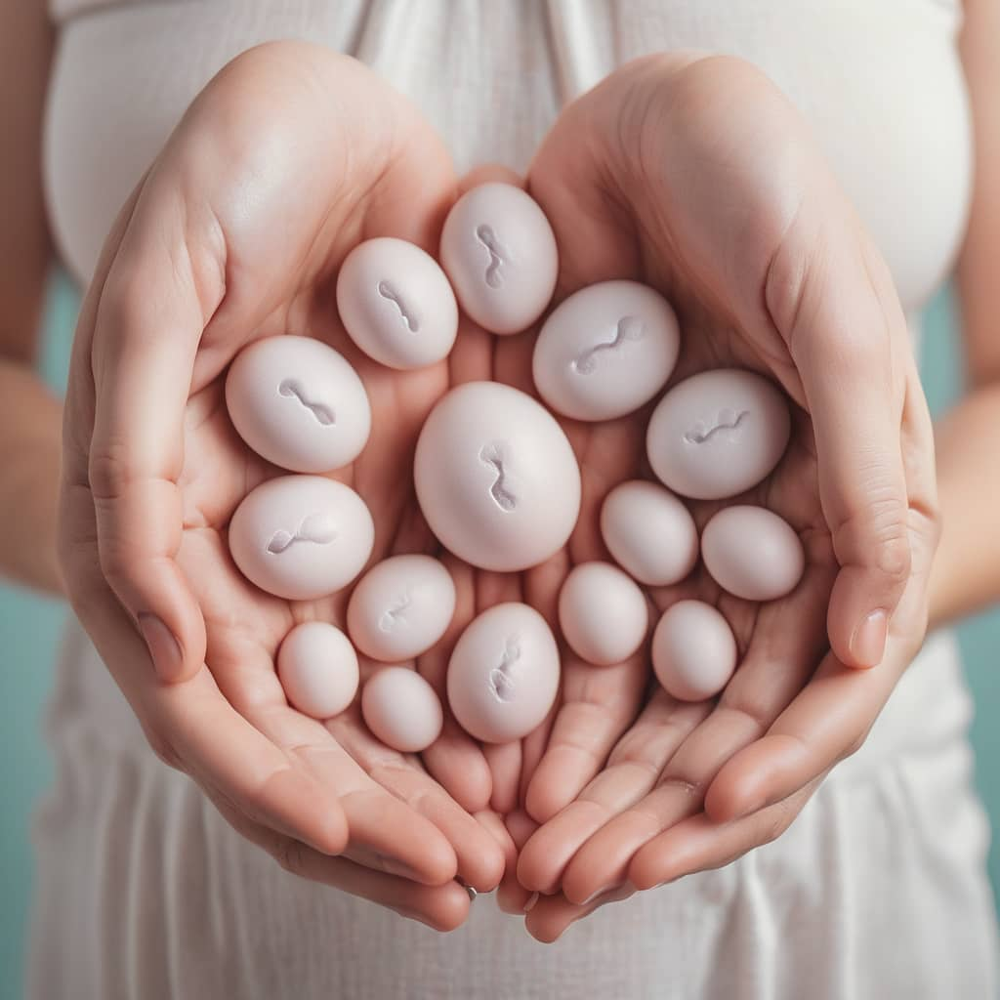

Mu bakuze cyangwa abakiri bato akenshi usanga ingingo yo kumenya igihe cya nyacyo  umukobwa/umugore aba afite amahirwe macye yo gusama itavugwaho rumwe, bamwe bati ni mbere abandi bagashimangira ko ari nyuma y'imihango .muri iyi nkuru tugiye kwifashisha ingero n’ibisobanuro byimbitse kugirango iki kibazo ukibonere igisubizo

Mbere yo gusubiza iki kibazo reka tugire ibintu bimwe gusobanukirwa.

1. **Imihango:** iki ni igihe umugore amara ava amaraso ya buri kwezi. Bimara hagati y'iminsi 3 kugeza ku 8. Iminsi iringaniye ikaba 5. Bivuze ko umugore uva iminsi irenga 8 cyangwa iri munsi y'itatu aba afite ikibazo akeneye kuvugana na muganga.
2. **Ukwezi k'umugore:** iyi ni iminsi iri hagati yo gutangira imihango no kongera kubona indi mihango. Ibi ni hagati y'iminsi 21 na 35, ugereranyije ikaba ari 28. Bivuze ko umugore ubona imihango ye mbere ya buri minsi 21 cyangwa nyuma ya buri minsi 35 aba afite ikibazo ndetse akeneye kuvugana na muganga.
3. **Ibice bigize ukwezi k'umugore:**hari igice cy'imihango, igice cyo kwiyubaka kwa nyababyeyi nyuma yo kuva, n'icyo kurekurwa kw'igi (ovulation).
4. **Igihe intanga ngabo imara ikiri nzima:**iminsi myinshi intangangabo ishobora kumara ikiri nzima ni itanu mu gitsina cy'umugore.
5. **Igihe igi rimara rikiri rizima:**nyuma yo kurekurwa, igi (ovum) rimara munsi y'amasaha 24 rikiri rizima nyuma y'aho riba ryapfuye.
6. **Ukwezi guhinduka:** ibi ni igihe umugore adafite iminsi ingana, aho urugero, ukwezi kwe gushobora kumara iminsi 30, ukundi kukamara 22, ukundi 35, gutyo gutyo.  Ubwo umaze gusobanukirwa n'ibi, reka dusobanure ibijyanye no gusama. Muri iyi nkuru turifashisha urugero rw'umugore ufite ukwezi kw'iminsi 28 kudahinduka. Uyu mugore igi rye rizarekurwa ku munsi wa 14, ibi bivuze ko igihe uyu mugore atangiye imihango byitwa umunsi wa mbere, niba amaze iminsi 4 mu mihango, aba asigaje iminsi 10 mbere yo kurekurwa kw'igi.**Ni ryari mugore ashobora gusama mu gihe akoze imibonano mpuzabitsina idakingiye?** 1. Mu minsi itanu mbere yo kurekurwa kw'igi. Kubera iki? Kubera ko intanga ngabo twabonye ko ishobora kumara iminsi itanu ikiri nzima mu gitsina cy'umugore. Bivuze ko ukoze imibonano mpuzabitsina idakingiye muri iyo minsi, n'ubwo igi riba ritararekurwa, igihe rizarekurirwa rizasanga intanga zigitegereje. Niba twabonye ko uyu mugore azarekura igi ku munsi wa 14 uhereye igihe yatangiriye imihango, ashobora gusama uhereye ku munsi wa 10 kugeza ku wa 14.                                                                        Ikindi gihe umugore afite amahirwe menshi yo kusama ni igihe igi ryarekuwe kugeza mu masaha 24 rirekuwe. Kubera iki? Niba igi rirekuwe rigahita rihura n'intanga ngabo, hazahita babaho gusama. Hanyuma kubera iki amasaha 24 nyuma? Kubera ko rya gi riba rikiri rizima.**Ni ryari umugore afite amahirwe macye yo gusama?** 1\. Ni nyuma y'amasaha 24 yo kurekurwa kw'igi kugeza abonye imihango. Bivuze ko ari iminsi 13 mbere y'imihango. Aha ni ku bagore bose hatitawe ku gihe ukwezi kwabo kumara, kubera ko iminsi iri hagati yo kurekurwa kw'igi no kubona imihango ingana ku bagore bose.2. Nyuma y'imihango: ku mugore ufite ukwezi kw'iminsi 28, aba afite amahirwe macye yo gusama uhereye igihe yatangiriye imihango kugeza iminsi itanu mbere y'uko igi rirekurwa, bivuze kuva ku munsi wa mbere kugeza ku munsi wa cyenda. Umugore ufite ukwezi kurekure agira iminsi myinshi mugihe umugore ufite ukwezi kugufi aba afite iminsi micye yo kudasama nyuma y'imihango ndetse biranashoboka ko umugore ashobora gusama mu gihe ari mu mihango niba ukwezi kwe kumara iminsi iri munsi ya 21. Iyi mibare ishobora kukujijisha ariko nusubiramo witonze uraza gusobanukirwa.Hari forumile ikoreshwa ariko ikunda kugora abantu kuko isaba gukurikirana ukwezi k'umugore mu gihe nibura cy'amezi atandatu (6) yikurikiranya.Gusa hari porogaramu (applications) zo muri telefone wakwiyambaza zikajya zikubarira, zikanakubwira niba uri mu gihe cy'uburumbuke cyangwa udafite amahirwe yo gusama, ndetse zikanakumenyesha igihe imihango yawe izazira. Izo porogaramu uzazisoma mu nkuru ikurikira.**Icyitonderwa:** Aya makuru ntabwo asimbura inama uhabwa na muganga, ni amakuru agamije ubumenyi gusa, uramutse ushaka uburyo bwo kuboneza urubyaro, kwirinda gusama n'ibindi bijyanye n'ubuzima bwawe bw'imyororokere wagana ivuriro rikwegereye cyangwa ukabaza muganga wawe.

****

**African Updates**
