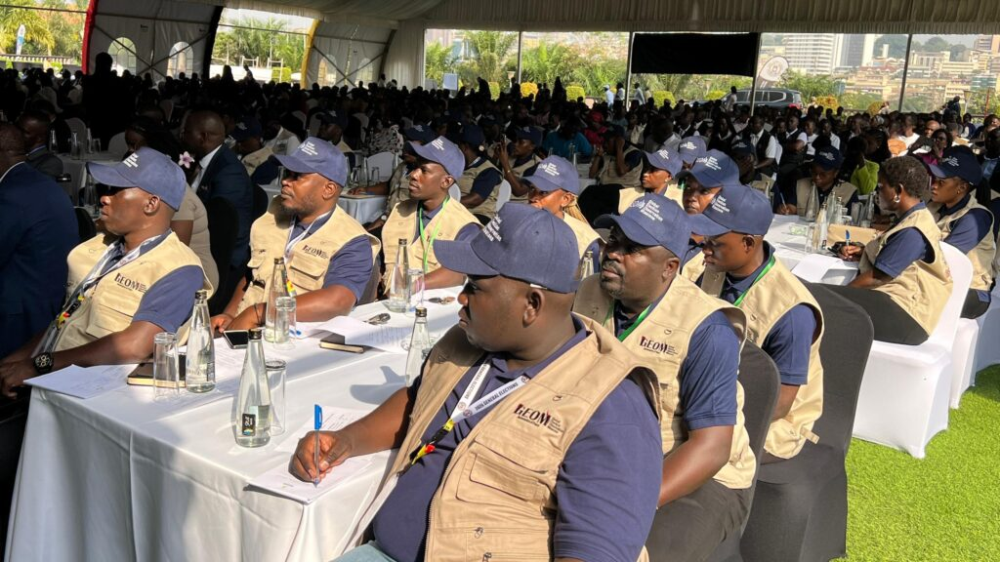
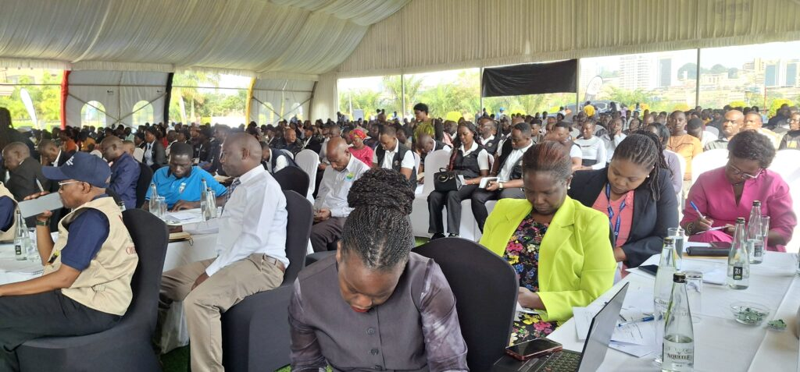
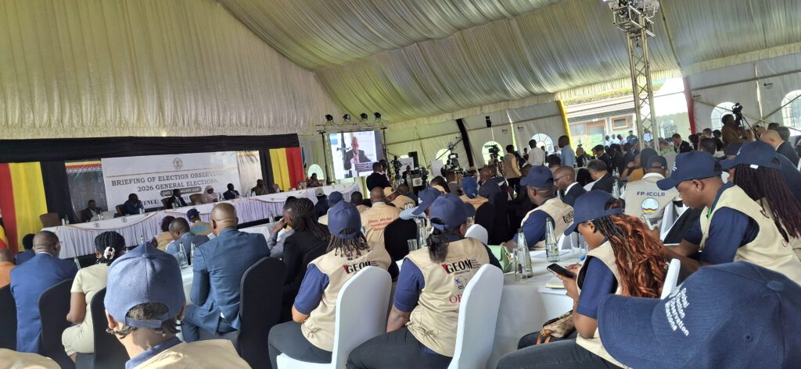

Kuri uyu wa mbere, Komisiyo y’Amatora muri Uganda yagiranye ibiganiro n’indorerezi z’amatora ziturutse hirya no hino ku isi, zaje gukurikirana imigendekere y’amatora y’Umukuru w’Igihugu n’ay’Abadepite ateganyijwe kuba kuri uyu wa kane, tariki ya 15 Mutarama 2026.

Ibi biganiro byitabiriwe n’indorerezi zitandukanye zirimo iz’imbere mu gihugu nka GEOM (Global Election Observation Mission), indorerezi z’Umuryango wa Afurika y’Iburasirazuba (EAC) zari zaherekejwe n’Umunyamabanga Mukuru w’uyu muryango, Madamu Veronica M. Nduva, izihagarariye COMESA, Umuryango wa Afurika Yunze Ubumwe (AU), ndetse n’abahagarariye ibihugu byabo muri Uganda n’abayobozi b’indi miryango mpuzamahanga.

\[caption id="attachment\_1570" align="alignnone" width="1024"\] Indorerezi za Global Election Observation Mission (GEOM) bitabiriye ibiganiro byateguwe na Komisiyo y'amatora ya Uganda.\[/caption\]

Umuyobozi wa Komisiyo y’Amatora ya Uganda, Bwana Justice Byabakama Mugenyi Simon, yavuze ko muri aya matora hazifashishwa ikoranabuhanga rigezweho hagamijwe gukumira ubujura bw’amajwi n’andi makosa ashobora kwangiza amatora. Yasobanuye ko mbere y’uko umuturage ahabwa impapuro zo gutora, azabanza kumenyekanisha umwirondoro we akoresheje igikumwe cyangwa isura (biometric verification) binyuze mu mashini zabigenewe.

Abatora bazahabwa impapuro eshatu zo gutoreraho; Umukuru w’Igihugu, abagize Inteko Ishinga Amategeko, ndetse n’umugore uzahagararira abandi mu Nteko Ishinga Amategeko. Nyuma y’isozwa ry’amatora, hazahita hatangira igikorwa cyo kubarura amajwi. Umuyobozi wa Komisiyo y’Amatora yijeje ko nta mpungenge z’ubujura bw’amajwi zihari, kuko hashyizweho ingamba zihamye zo kubikumira.

Bwana Byabakama,Yibukije ko, hashingiwe ku mategeko agenga amatora muri Uganda, ibikorwa byo kwiyamamaza bigomba guhagarara amasaha 48 mbere y’umunsi w’amatora. Yasabye abakandida n’ababashyigikiye kubahiriza amategeko no kwirinda ibikorwa byahungabanya umutekano n’ituze by’igihugu. Yanashishikarije indorerezi gukora inshingano zabo mu bwisanzure no gutanga amakuru mu nzira zemewe mu gihe babonye ibitagenda neza.

Indorerezi zamenyeshejwe ko zemerewe gutegura raporo zazo ku matora, kandi ko izo raporo zigomba gutangwa bitarenze amezi atandatu nyuma y’amatora.

Bwana Byabakama yasabye abaturage ba Uganda kwitabira amatora ku bwinshi, agaragaza ko gutora ari uburenganzira bwabo bw’ibanze bubafasha kwihitiramo abayobozi bazabayobora mu gihe kiri imbere.

Inzego z’umutekano na zo zatangaje ko ziteguye neza. Umuyobozi Mukuru wa Polisi ya Uganda (Inspector General of Police - IGP), Abbas Byakagaba, yavuze ko inzego z’umutekano zikomeje akazi kazo ko kwitegura umunsi w’amatora. Yijeje abitabiriye ibi biganiro ko umutekano uzabungabungwa mu gihugu hose.

Yatangaje ko kuri buri site y’itora hazaba hari abashinzwe umutekano, ku bufatanye n’izindi nzego, kugira ngo ibikorwa byose by’amatora bigende neza. Yongeyeho ko Polisi izabungabunga amahoro n’ituze ry’abaturage, ikanacungira hafi ibikorwaremezo n’ibikoresho bizifashishwa mu matora.

Imibare igaragaza ko abazitabira amatora ari abasaga miliyoni 21.6 bakazatorera kuri site z’itora 50,739 zizaba ziri mu gihugu hose.

Perezida Yoweri Kaguta Museveni ni umwe mu bakandida bari guhatanira kongera kuyobora Uganda, umwanya ariho kuva mu 1986. Ubu ahanganye bikomeye na Robert Kyagulanyi, uzwi ku izina rya Bobi Wine. Abandi bakandida ku mwanya w’Umukuru w’Igihugu barimo Frank Bulira, Robert Kasibante, Joseph Mabirizi, Nandala Mafabi, Mugisha Muntu na Mubarak Munyagwa.

 

**African Updates**
