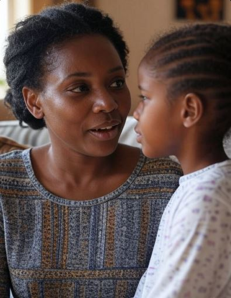

Imihango (periods) ni kimwe mu bigaragaza ko umukobwa atangiye urugendo rwo gukura. Igihe umukobwa abonye imihango bwa mbere, biba bikwiye ko umubyeyi cyangwa undi muntu mukuru amuganiriza akamufasha kubyumva neza no kumenyera uko abayeho.

Umwana w’umukobwa ashobora kubona imihango afite hagati y’imyaka 9 na 14. Bwa mbere, aba adafite ubumenyi buhagije ku mihango n’uko yitwaramo. Ubushakashatsi bwakozwe mu Rwanda bugaragaza ko buri mukobwa 1 muri 4 asiba ishuri kubera ibibazo bijyanye n’imihango. Abandi bakobwa bavuga ko batinya kubaza cyangwa kuvuga ibijyanye n’imihango kuko batekereza ko ari ishyano cyangwa icyaha. Iyo umwana aganirijwe, amenyera umubiri we, agira icyizere kandi akabaho mu buzima butarangwamo ipfunwe n'ubwoba.

1. **Iby’ingenzi umubyeyi akwiye kubwira umwana**

**Imihango ni ibisanzwe kandi ntacyo itwaye**

Imihango ni ibisanzwe kandi ntacyo itwaye kubera ko Imihango ari ikimenyetso cy’uko umubiri ukura. Ni ibisanzwe kandi ntigomba gutera umwana ipfunwe.

Buri kwezi, hari amaraso asohoka mu myanya y’ibanga y’umukobwa. Ni uko umubiri uba uteye, ntibivuze ko arwaye.

**Uko yitwararika ku isuku n’ubuzima**

Mwigishe uko akoresha impapuro z’isuku (pad), kuyihindura buri masaha ari hagati ya 4-6, kuyijugunya neza, no koza intoki mbere na nyuma yo kuyikoresha.

Kumwibutsa ko agomba kwiyuhagira buri munsi, cyane cyane mu minsi y’imihango.

Niba atabona impapuro z’isuku (pads) zihagije, umwigishe uko yakoresha izindi nzira nk’ibitambaro cyangwa izindi zagenewe gukoreshwa inshuro nyinshi (reusable pads).

**Ibimenyetso bishobora kugaragara ku mubiri we**

Kumva ububabare mu nda, guhinduka kw’amarangamutima, kumva ashaka kurira cyangwa guhinda umushyitsi, ibyo byose ni ibisanzwe.

Aramutse agize ibibazo bikomeye nko kuva amaraso menshi cyane cyangwa kubabara birenze urugero, mushishikarizwe kubibwira umubyeyi cyangwa kujya kwa muganga.

**Kumwigisha gutandukanya ukuri n’ibinyoma**

Mubwire ko Imihango atari ishyano, Si uburwayi, Si igihano, Ni ibihe bisanzwe mu buzima.

Ntagomba kubifata nk’ikintu gitera ipfunwe.

2. **Uburyo bwo kubimubwiramo**

**Hitamo igihe n’ahantu haboneye**

Shaka umwanya mwiza, mufite umwanya muto wo kuganira, ahantu hatuje kandi hatari abandi bantu.

**Tangirana neza**

Urugero: “Mwana wanjye, ndashaka ko tuganira ku kintu cy’ingenzi ku buzima bwawe.” Cyangwa: “Ese uzi ibyo bita imihango? Waba warigeze kubyumva?”

**Mwumve kandi umwubahe**

Niba afite impungenge, umutere inkunga. Niba afite ibibazo, umusubize witonze kandi mu buryo  wubaka.

**Sangira uburambe bwawe**

Ushobora kumubwira uko byagenze bwa mbere ubona imihango, kugirango yumve neza ko nawe byakubayemo kandi umufungukiye ukamusangiza ibyakubayeho.

3. **Icyo umubyeyi akwiye kuzirikana**

Mubyeyi zirikana ko Kuganira na we bituma yumva ko afite ubufasha.

Ibi biganiro nk’ibi si iby’umunsi umwe gusa. Biba byiza kubisubiramo uko bikenewe.

Mubyeyi Ntumutegeke, ahubwo umuhe umwanya wo kugira uruhare mu biganiro.

Iyo umwana w’umukobwa aganirijwe ku bijyanye n’imihango biramuhumuriza, bigatuma atagira ubwoba. Bituma yisanzura kuko aba azi ibyo agomba gukora. Yiga kwiyitaho akagira isuku, akamenya uko yitwara. Ikindi n’uko bimwubakira icyizere ntibimuteshe agaciro.

**African Updates**
