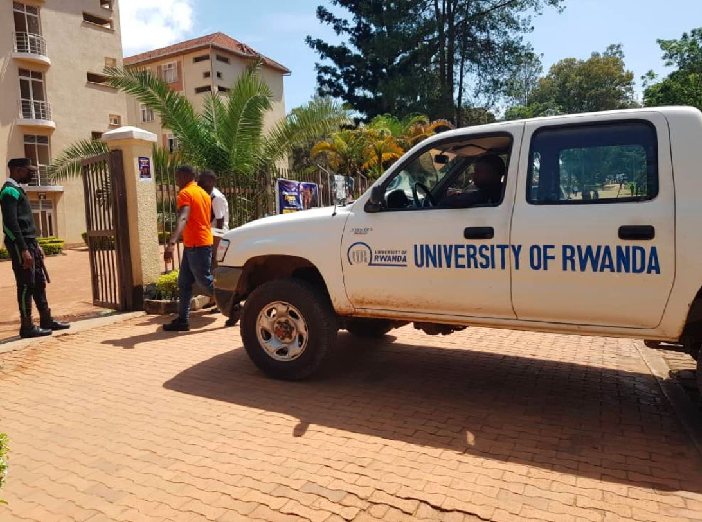
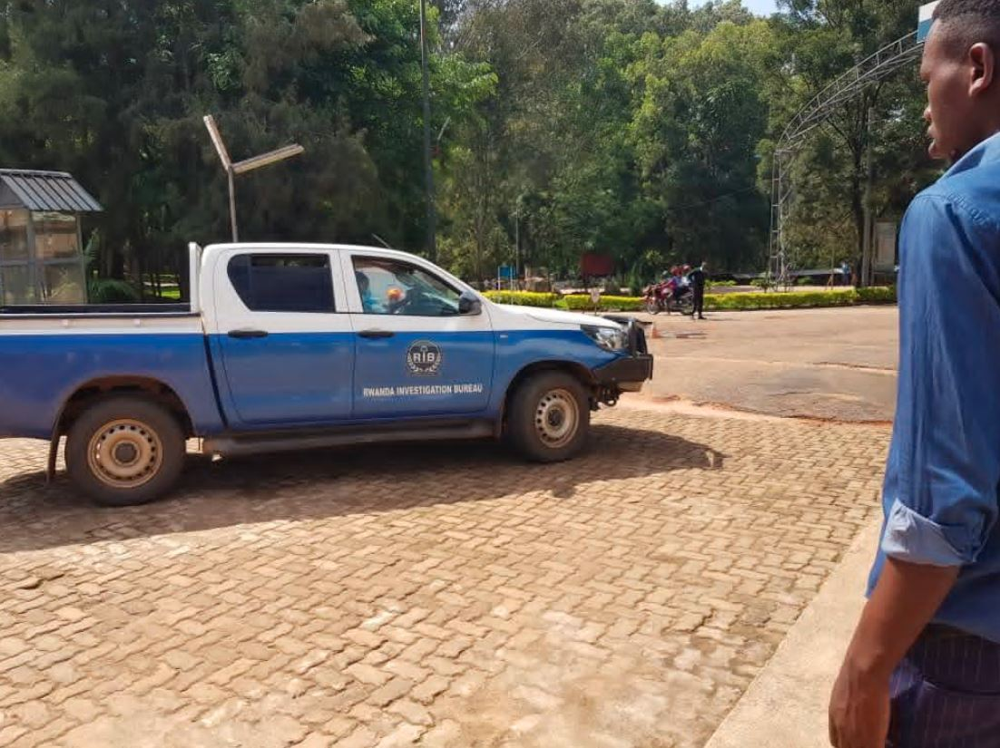
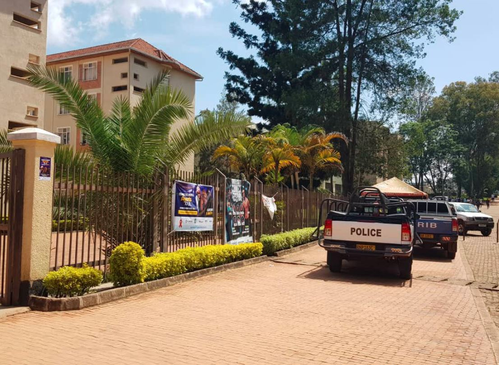

Urwego rw’Igihugu rw’Ubugenzacyaha (RIB), rwataye muri yombi umukobwa w’imyaka 19 wiga muri Kaminuza y’u Rwanda, Ishami rya Huye, akekwaho gukuramo inda, umwana akamuta aho bajugunya imyanda, .

Ni nyuma y'uko mu nyubako icumbikamo abakobwa izwi nka Benghazi, mu gitondo cyo kuri uyu wa gatanu hatoraguwe uruhinja rw’amezi 8 rwari mu gatebo gasanzwe gashyirwamo imyanda rwasanzwe rwapfuye.

Urwo ruhinja ngo rwabonywe n’umukozi ushinzwe amasuku bigakekwa ko byaba byakozwe numwe mu banyeshuli baharara.

Ukekwaho gukora icyo cyaha ari kwitabwaho kwa Muganga ndetse hanakusanywa ibimenyetso bizifashishwa mu kugaragaza niba hari isano riri hagati y’ukekwa n’urwo ruhinja.

Icyaha cyo kwikuramo inda giteganwa n’ingingo ya 123 y’itegeko No68/2018 ryo ku wa 30/08/2018 riteganya ibyaha n’ibihano muri rusange.

Aramutse ahamwe n'icyaha yahanisha igihano cy’Igifungo kiva ku mwaka umwe ariko kitarenze imyaka itatu n’ihazabu y’amafaranga y’u Rwanda kuva ku bihumbi 100 FRW ariko atarenze ibihumbi 200 Frw.

RIB ntisiba gukangurira abantu kwirinda ibyaha ndetse no gutanga amakuru ku babikoze.

Uru rwego rwasabye by’umwihariko urubyiruko kwirinda ibikorwa by’ubusambanyi, ubusinzi, gukoresha ibiyobyabwenge n’ibindi bikorwa byose by’ubwomanzi kuko ari byo ntandaro yo kwishora mu byaha bitandukanye birimo n’ibi byo kwikuramo inda.

**African Updates**
