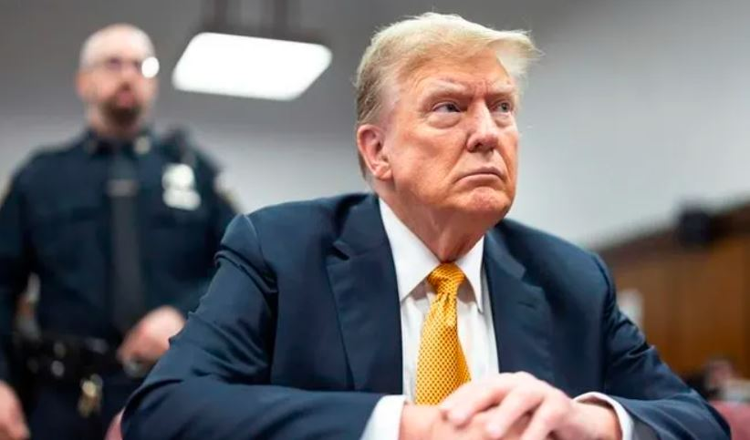

Donald Trump wigeze kuyobora amerika yahamijwe n’urukiko ibyaha 34 bishingiye ku gutanga amafaranga ngo umugore yasambanyije aceceke.

Ni umwanzuro watangajwe kuri uyu wa kane ndetse ni ubwa ubwa mbere mu mateka ya Amerika bibaye aho uwabaye perezida ahamijwe ibyaha n’urukiko.

Icyo cyemezo kandi cyatangajwe mu gihe habura amezi atanu ngo habe amatora y’umukuru w’igihugu kandi yagaragaje ko yifuza kuziyamamazamo.

Icyakora ntihatangajwe igihano yafatiwe bikaba biteganijwe ko bizatangazwa ku itariki ya 11 Nyakanga 2024. Hagati aho Trump yaburanye adafunze ndetse n’ubu niko birakomeza kugeza igihe urukiko ruzatangariza imyanzuro irimo n’ibihano yafatiwe yaba ari ugutanga ihazabu, igifungo gisubitse cyangwa gufungwa.

Kuba yahamijwe ibyaha ariko ntibyamubuza kuba yakomeza gahunda yo kuziyamamariza umwanya wa Perezida wa Amerika gusa abakurikira amategeko na politike y’icyo gihugu bavuga ko bishobora kumugabanyiriza amahirwe yo gutsinda.

Donald Trump ashinjwa kwishyura amadolali 130,000 ku mukinnyi wa filimi z’urukozasoni Stormy Daniels kugirango atabivuga bigatuma adatsinda amatora yo mu 2016.

**African Updates**
