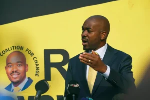
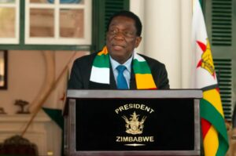

Umuyobozi w’abatavuga rumwe n’ubutegetsi bwa zimbabwe, Nelson Chamisa, yatangaje ko ariwe watsinze amatora yo muri iki gihugu nyuma yo kutemera ibyangajwe na komisiyo y’amatora ya zimbabwe ko perezida emmerson mnangagwa yatsindiye  manda ya kabiri ku butegetsi.

Mu kiganiro n'itangazamakuru, Chamisa yavuze ko Muri Zimbabwe Hagiye kuba impinduka, Ndetse ko Batazategereza imyaka itanu

\[caption id="attachment\_866" align="alignnone" width="300"\] Nelson Chamisa umukandida perezida - Zimbabwe\[/caption\]

Chamisa yavuze ko Atemera Ibyavuye mu matora Kuko Ngo Nuburyo yakozwemo Bigaragaza ko Yabayemo Uburganya

Imibare yatangajwe na komisiyo y’amatora ya zimbabwe yatangajwe kuri iki cyumweru igaragaza ko nelson chamisa w’imyaka  45 uyobora ishyaka ritavuga rumwe n’ubutegetsi yatowe kugiteranyo cy’ amajwi 44%, mu gihe ishyaka rya zanu-pf riyobowe na  emmerson mnangagwa ryatsinze kugiteranyo cy’amajwi  69%.

Nelson Chamisa  ntaragaragaza ibimenyetso by’ibyo arega ishyaka rya ZANU-PF Ryatangajwe N’Iryatsinze Amatora,  icyakora  afite icyumweru cyo kujyana ikirego cye mu rukiko.

\[caption id="attachment\_867" align="alignnone" width="300"\] Perezida Emmerson Mnangagwa wa Zimbabwe\[/caption\]
